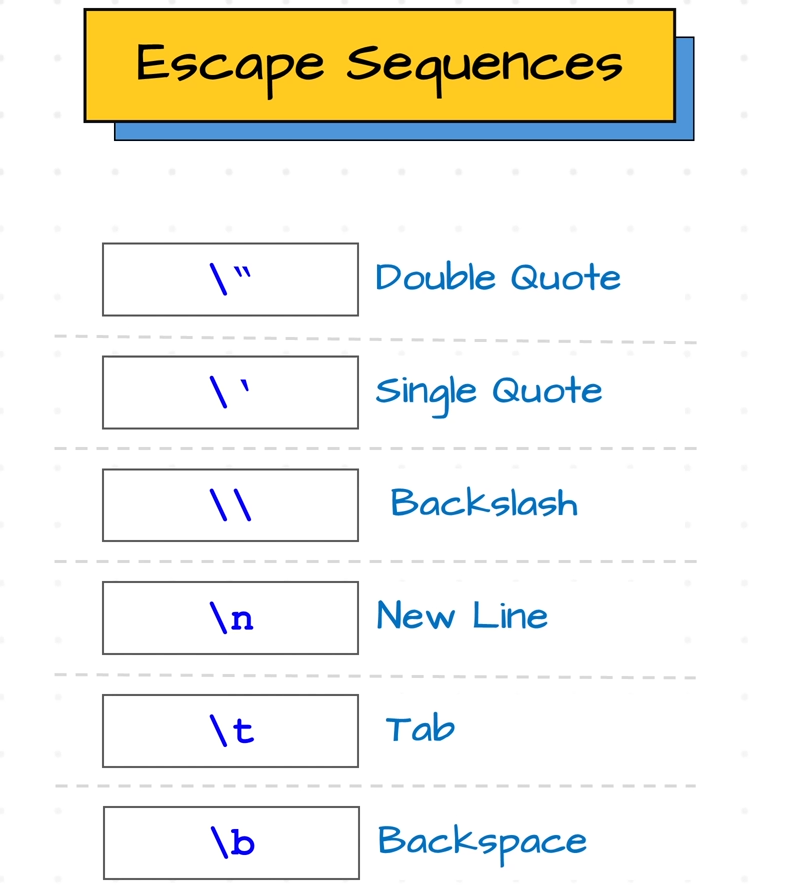
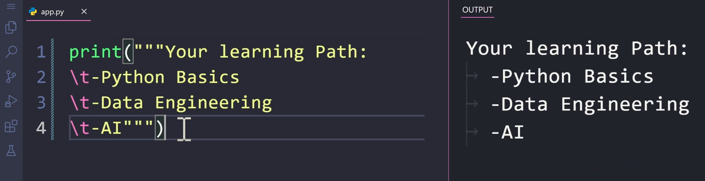
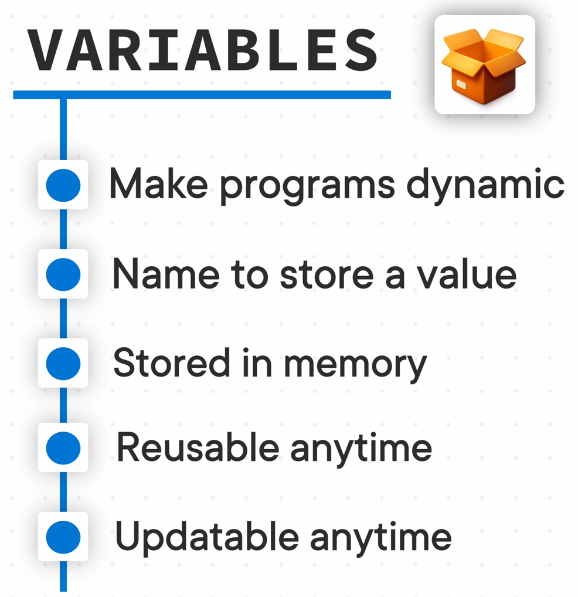
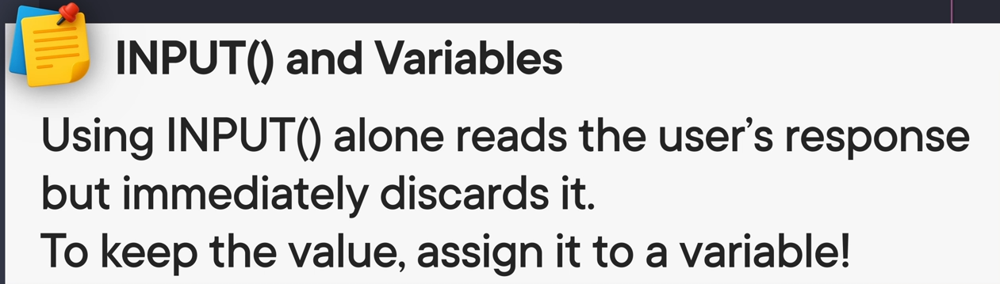

# Section 2

### **[Slides](.Resources/litratur.pdf)**

### **[python](https://www.python.org/)**

### **Roadmaps**
> [Python Course Mindmap](https://www.mindmeister.com/app/map/3916039125?t=ou8ZR0zayk)
>
> [Notion Python Course Planner](https://www.notion.com/templates/python-roadmap)

## **12)**

### **Escape Sequences**

## **13)**

### **per me bo print new line pa /n duhet me perdor """ n ven "" (nese bojna /n perdor extra new line)**

## **14)**

### **qka osht variabla**
>Variabla osht ni emer qe munesh e krijo ni vler edhe me perdor kurte vyn
>
>munesh me i marr te dhonat ose me shti new

### **, ne print**
>print("123", name);
>
>by default 123 rrezz(pra , e vendos vet ni spave)

### **Variablat**

## **15)**

### **Inputi**

