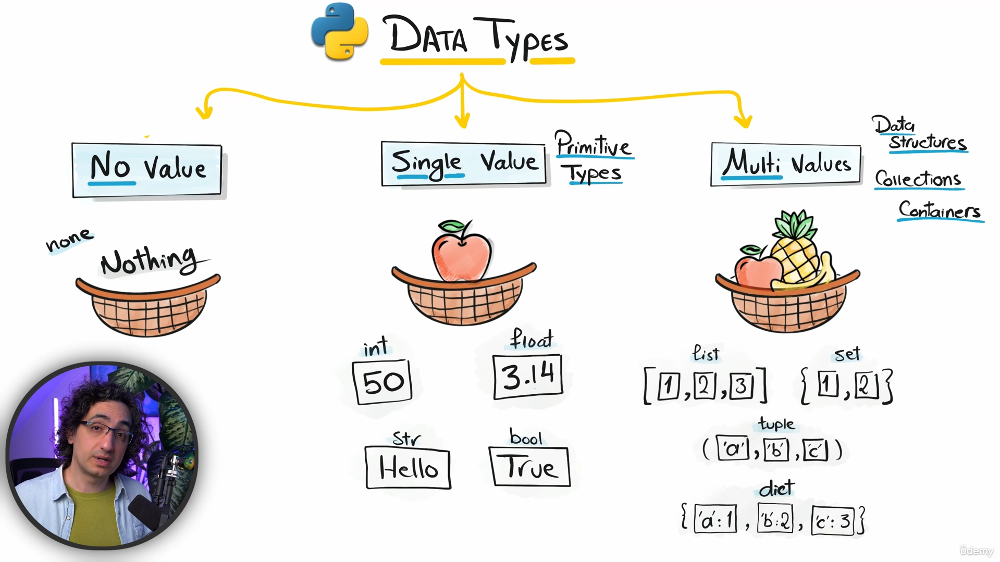
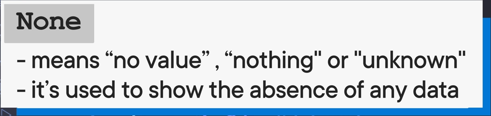
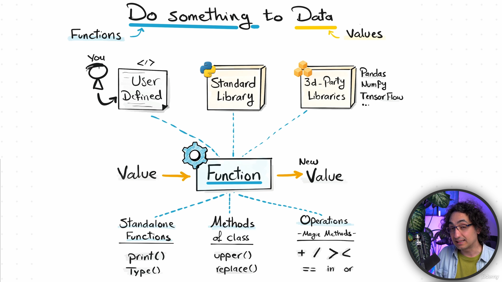
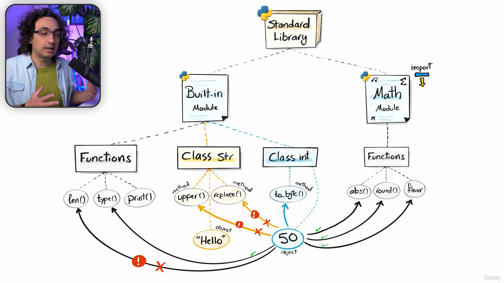
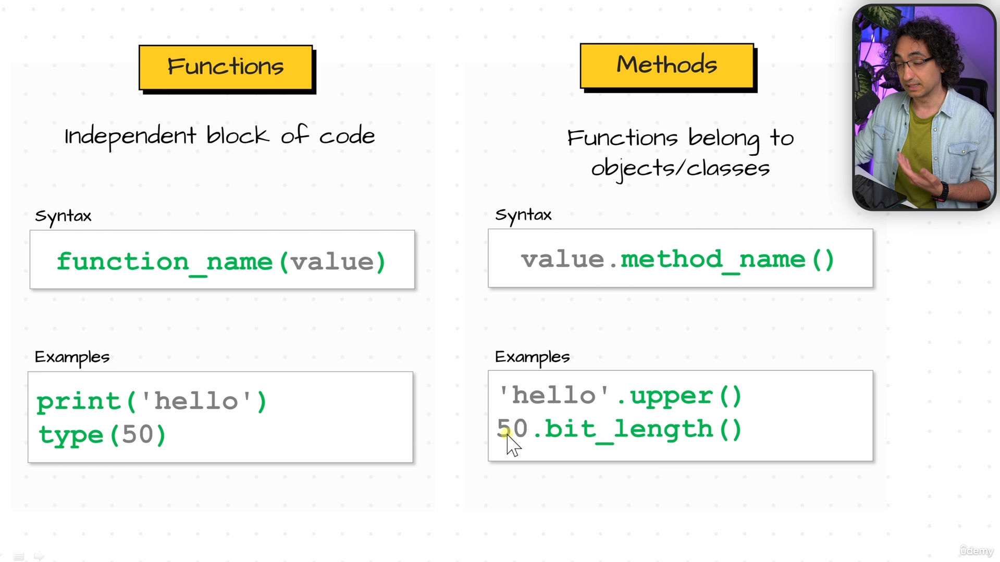
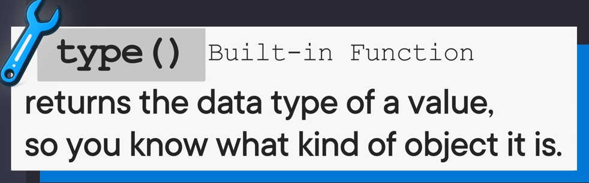
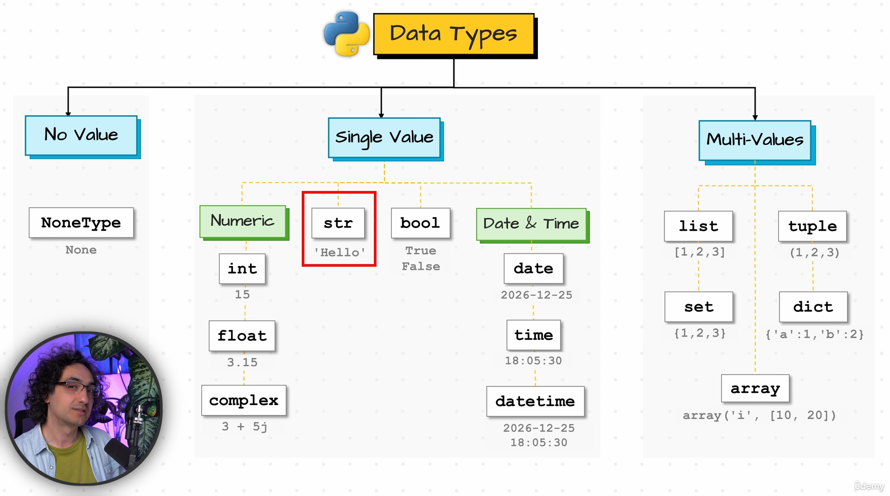

# Section 3

## **18)**

### **Data Types**
>python i bon detect by it self ski nwvoj mi deklaru
>
>mun me override prej x = 10 , te x = "abc" , vet bohet convert prej int n string

## **19)**

### **llojet e Data Types**

### **NONE**

### **String blank**
> a = ""

### **String empty space**
> a = " "

## **20)**

### **Function**

### **Standard lib**

### **Qysh funksionojn funksonet edhe metodat**

## **21)**

### **type()** (build-in function)

### **len()** (build-in function)

### **upper()** (build-in function)

### **bit_length()** (build-in function)

### **data typea**

