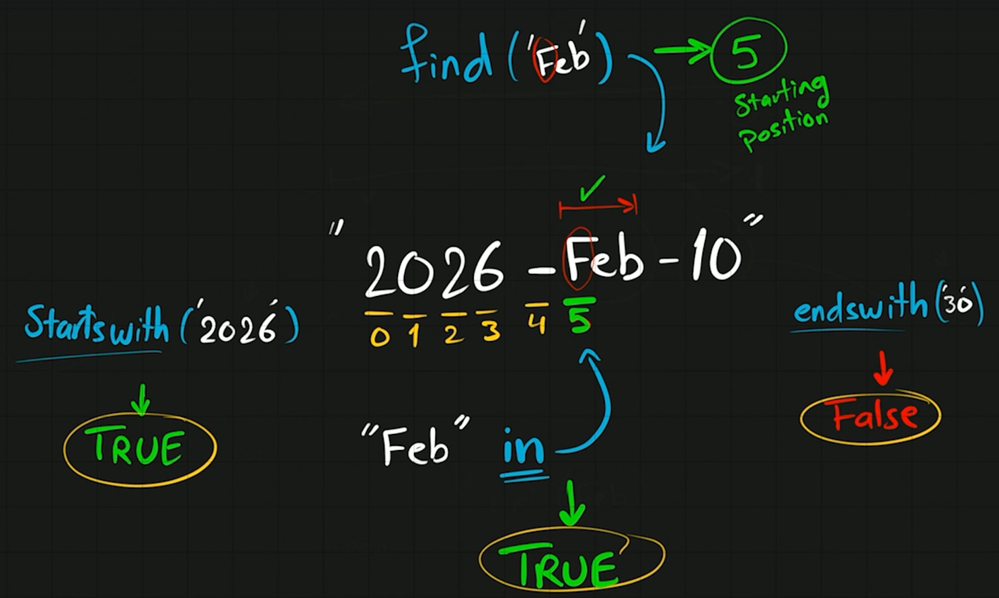

# **Section 4**

## **24)**

### **Strings**

### **Build-in Functions**

### **Methods of <str-class>**

### **Operatos**

## **25)** (Type Function)

### **types(value)**

### **nese don me convert int n string:**

## **26)** (String Operators)

### **Count**

### **how count work**

## **27)** (Replace)

### **mujna mi perdor 2 direkt**

## **29)** (Joining)

### **e spjegon qeta edhe psh per name + " " + username**

## **30)** (f-Strings)

### **ski nevoj as me i convert intat n string po direkt ja bon**
>nese dojna me perdor te f-String {text} duhet me bo {{text}}

## **31)** (Splitting)

## **32)** (Repeating)

## **33)** (Indenxing and Slicing)

shembulli me [0,1,2,3,4,5]
>[Start:End] ([0:3])
>
>>
>> i mer 0,1,2
>
>[Start:]* ([0])
>
>> i mer 0,deri fund array
>
>[:End]* ([5])
>
>>dmth 0,1,2,3,4
>>
>> i mer prej fillimi dej te 5
>
>[Start:End:Step] ([0:5:2])
>
>>dmth step qdo dytin step
>>
>>i mer 0,2,4

## **34)** (Removing Spaces)

### **strip ,lstrip, rstrip**
>text.strip() remove spaces from both ends
>
>text.lstrip() remove spaces from left
>
>text.rstrip() remove spaces from right

### **strip specifix characters**
>text.strip(character)

## **35)** (Low conversion)

###**text.lower()**

###**text.upper()**

## **36)** (Searching)

## **text.startswith("123")**
>kthen true/false

## **text.endswith("123")**
>kthen true/false

## **text.find("123")**
>kthen poziten ku e ka gjet

## **37)** (Validing string)

## **isslpha()**

## **isnumeric()**

