# Section 4

## **24)**

### **Strings**

### **Build-in Functions**
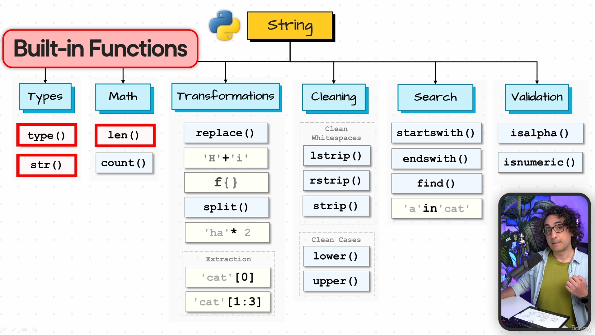

### **Methods of <str-class>**
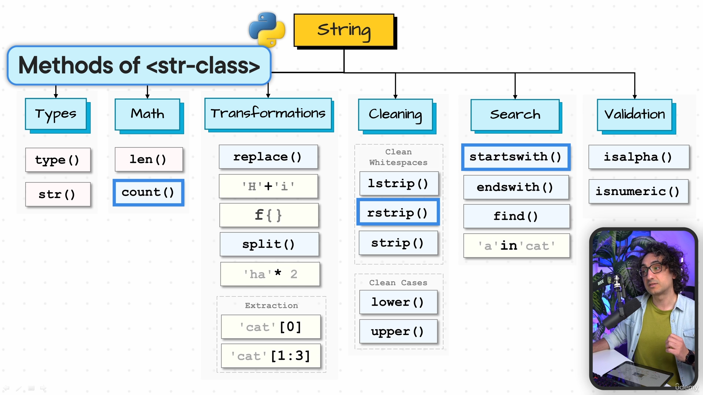

### **Operatos**
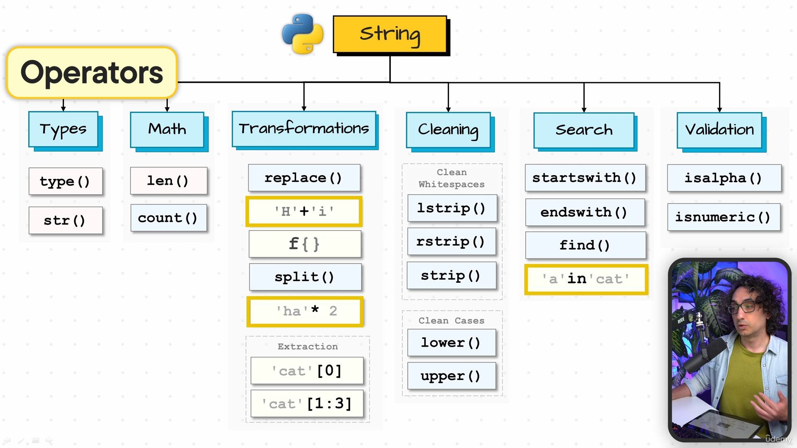

## **25)** (Type Function)

### **types(value)**
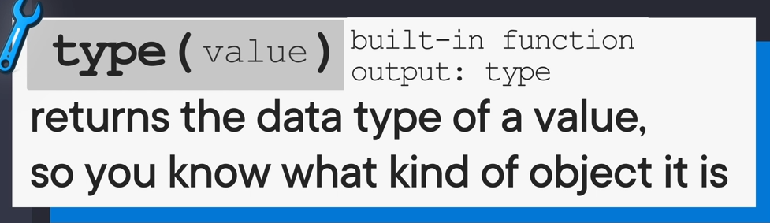

### **nese don me convert int n string:**
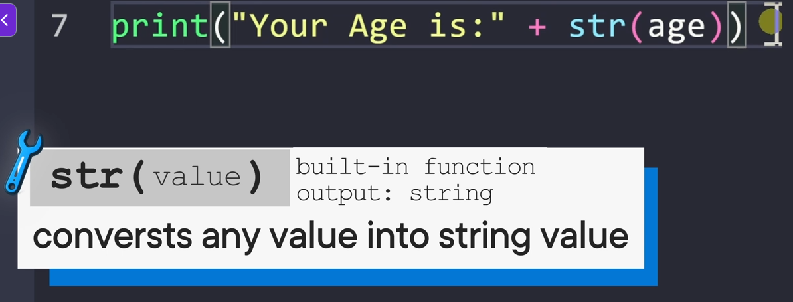
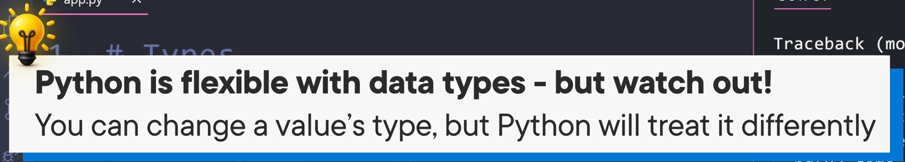

## **26)** (String Operators)

### **Count**

### **how count work**
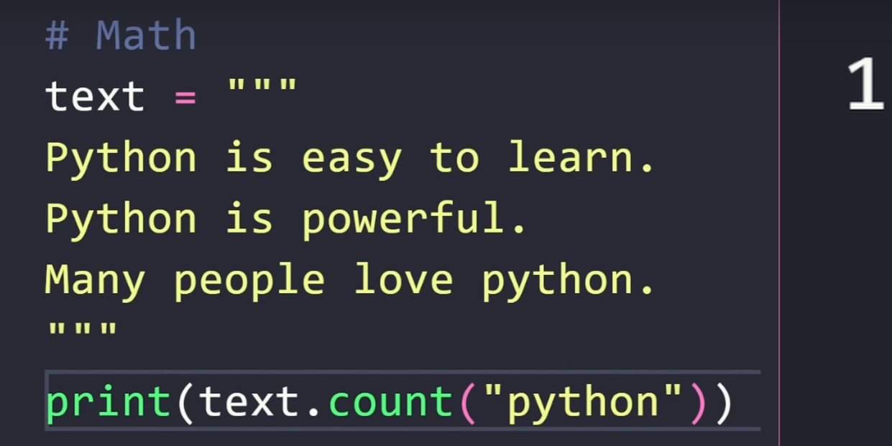

## **27)** (Replace)

### **mujna mi perdor 2 direkt**
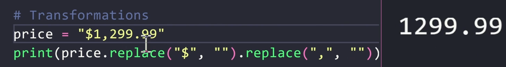

## **29)** (Joining)

### **e spjegon qeta edhe psh per name + " " + username**
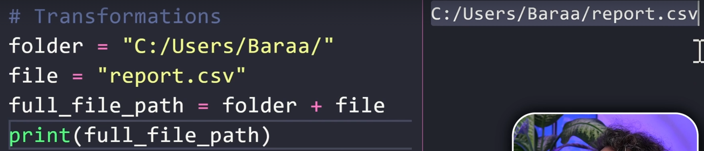

## **30)** (f-Strings)

### **ski nevoj as me i convert intat n string po direkt ja bon**
>nese dojna me perdor te f-String {text} duhet me bo {{text}}

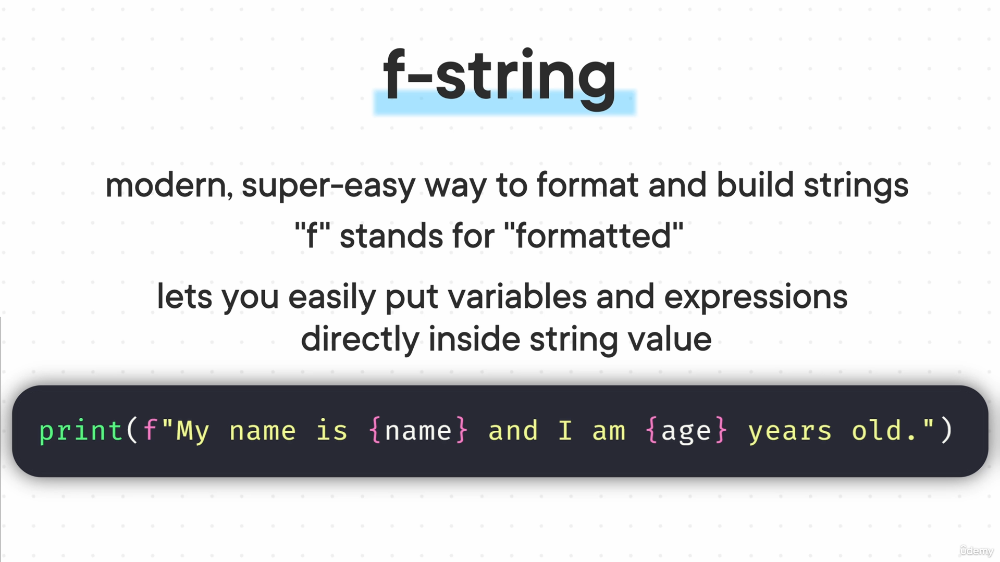

## **31)** (Splitting)

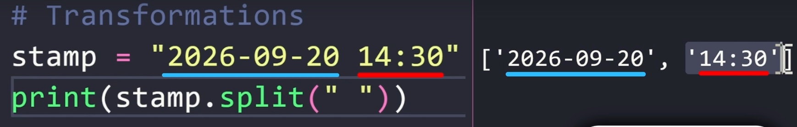

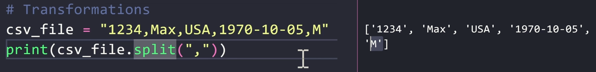

## **31)** (Repeating)

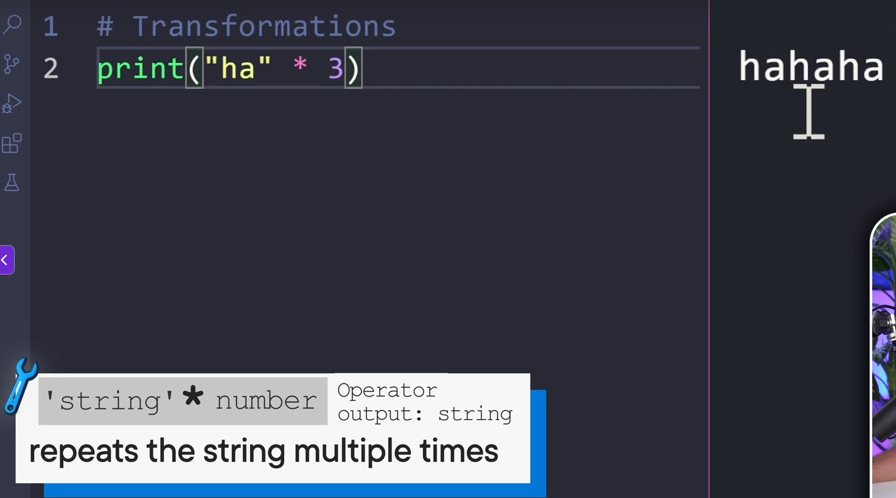

## **31)** (Indenxing and Slicing)

>[Start:End]
>>dmth 0:3
>>
>> i mer 0,1,2
>[Start:]*
>>dmth 0:...
>>
>> i mer 0,deri fund array
>[Start:End:Step]
>>dmth 0:...
>>
>>i mer 0,deri fund array
