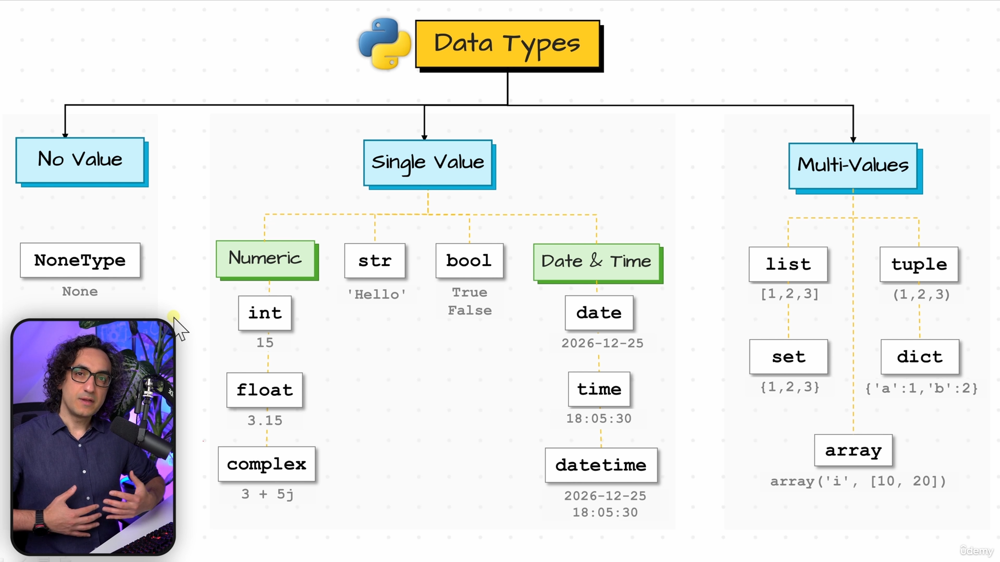
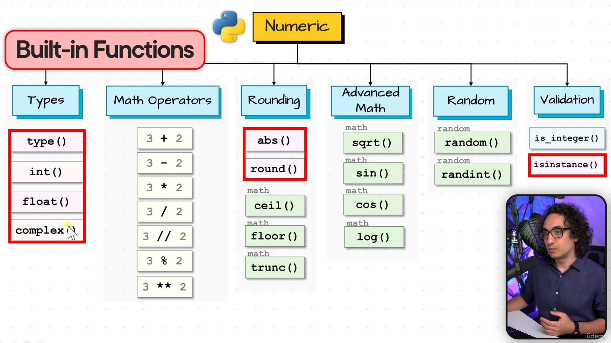
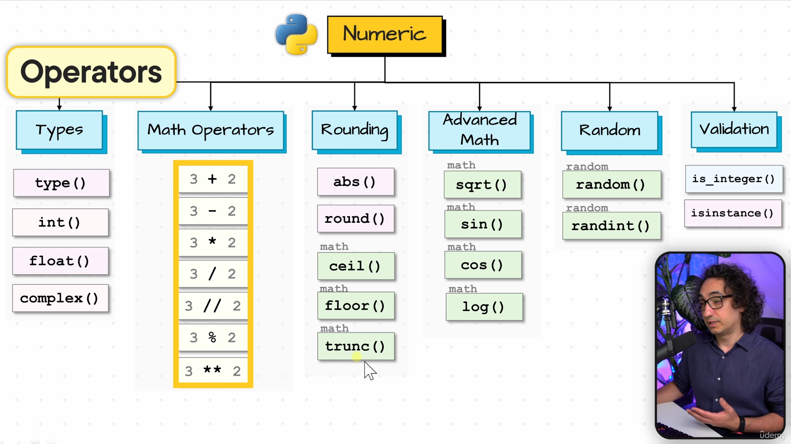
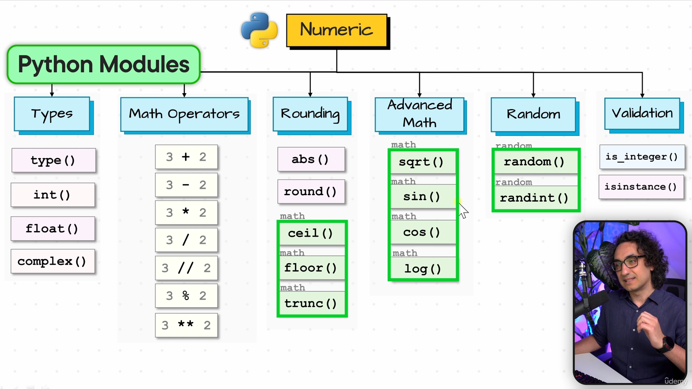
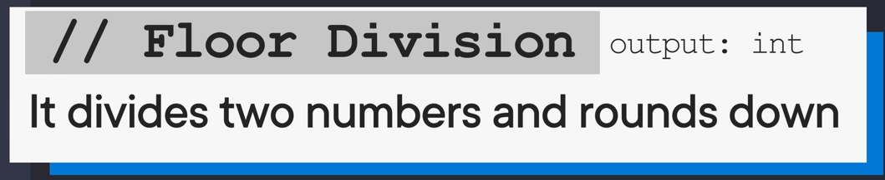
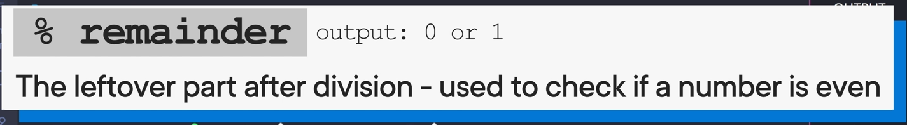
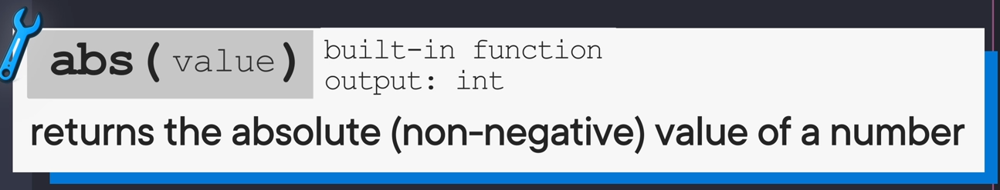

# **Section 5**

## **41)**

### **3 tipe t numrave**

### **Build-in Functions**

### **Operators**

### **Python Modules**

## **42)** (Types)

### **Numrat complex**
>x = 1 +2j
>
>

## **43)** (Number Operators)

### **Floor Division**
>%
>
>

### **a osht tek a qift**
>%
>
>

### **Exponentation**
>**
>
>dmth 2 ** 3 = 8 (2*2*2)
>
>

### **<Operation>=**
>perdoret psh x *= 4 (vlera x = vlera x *4)
>
>

## **44)** (Rounding)

### **math**
>duhet me import gjithkun
>
>pra import math nalt kejt

### **abs(value)**
>x = abs(2-10) = 8
>
>o e mir per per size , distanc etj
>
>

### **math.floor() , math.celim() , round()**
>**
>**
>output: 10.55

### **math.trunc(35.45981)**
>i pren numrat pra outputi: 35
>
>ose mujna veq me convert n int
>
>preferohet trunc se mun me tu pshtjell menon qe o string e je te bo int
>
>

### **random**
>duhet me import gjithkon
>
>pra import random nalt kejt

### **.random()**
>e gjeneron ni nr random 0-1
>
>

