# Section 6

## **50)**

### **Control Flow**
>o logjika qe e shkrun per me kontrollu qysh kodi bohet run

### **Control Flow Tools**
>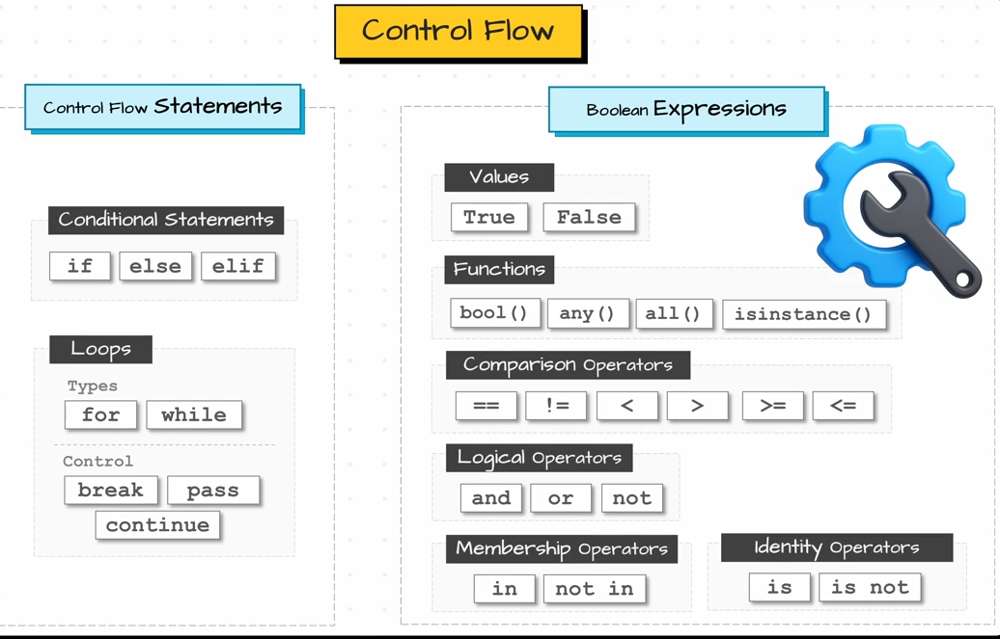

## **51)** (working with boolean)

### **bool(value)**
>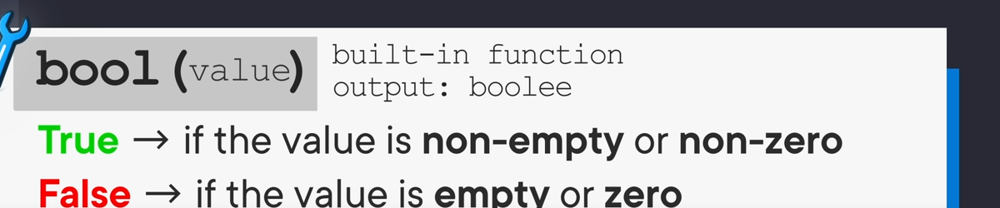

### **None**
> x = None
> 
>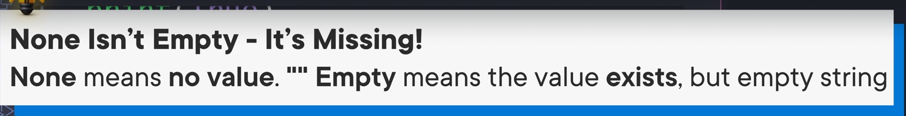

### **any([value,value])**
>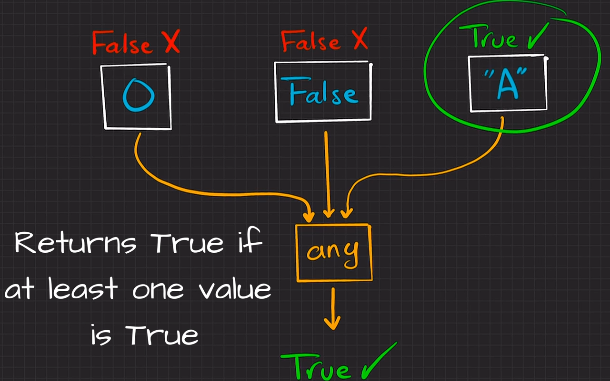

### **all([value,value])**
>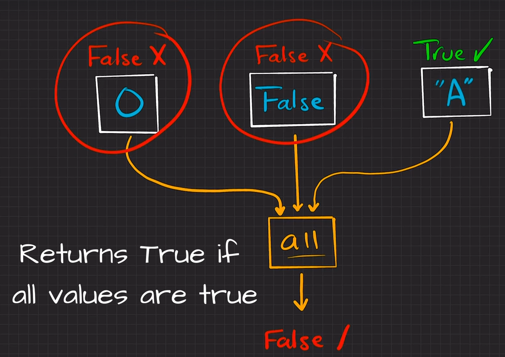

### **isinstance(value, type)**
>e kena permen edhe ma heret i kqyr a jon qato type
>
>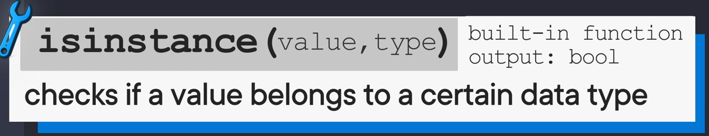

## **52)** (Comparison Operators)

>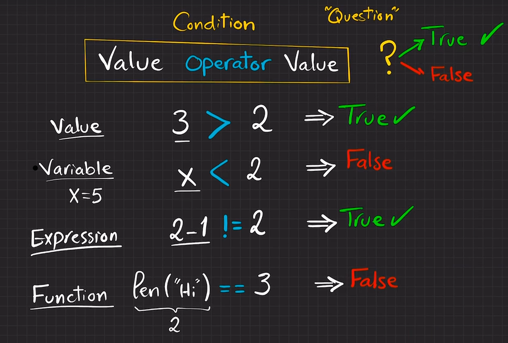

### **"string" < "string"**
> "a" < "b" = true
>
> "a" == "b" = false
>
> o case-sensitive 
> 
>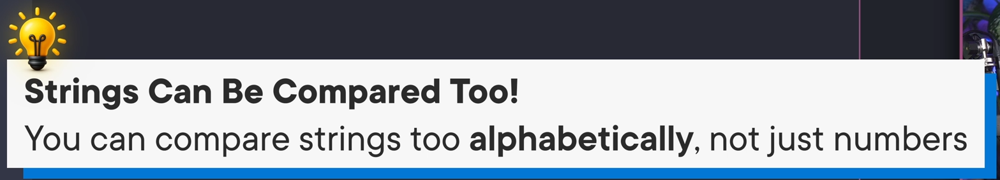

### **value < value < value**
> 2 < 4 < 6 = true
>
> i kqyr njo ka nnjo prej t majtes
>
>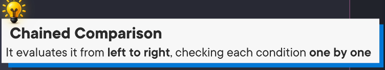

### **is age between 18 and 30**
>
>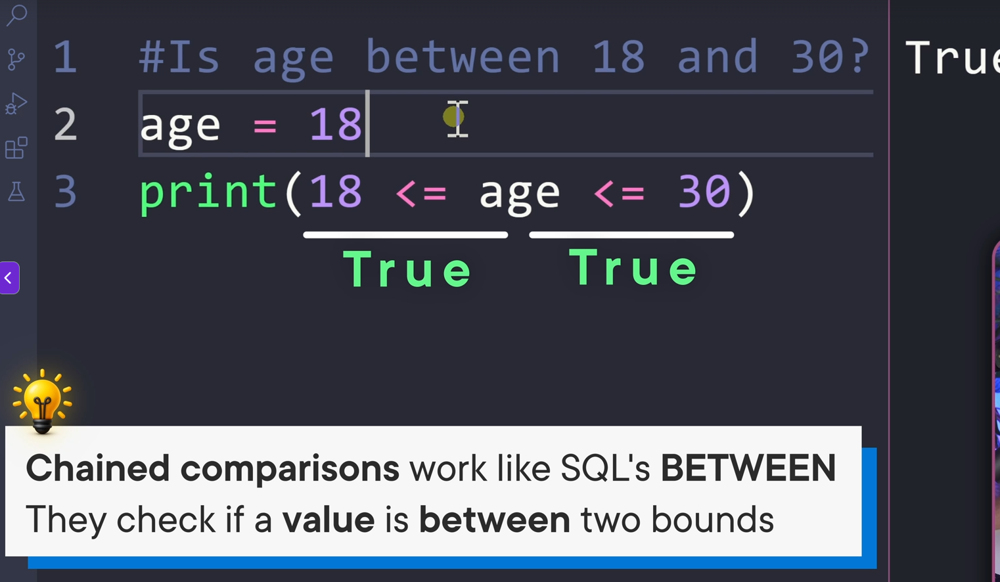

## **53)** (Logical Opration)

>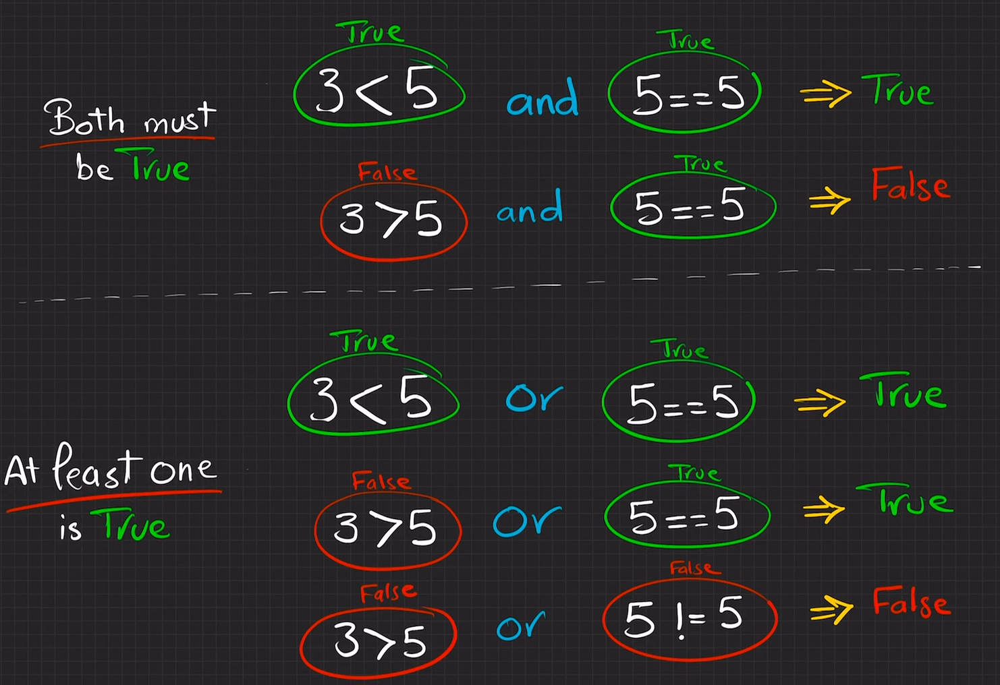

## **55)** (Not Operator)

>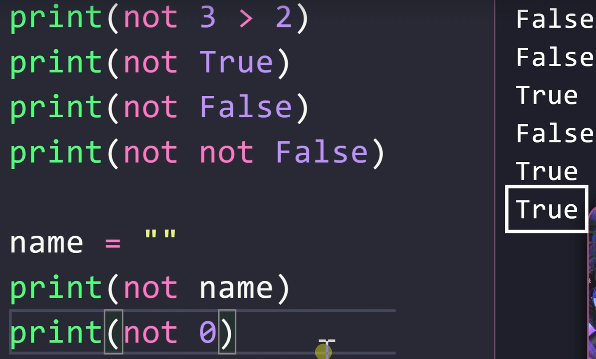

## **56)** (Execution Order)

>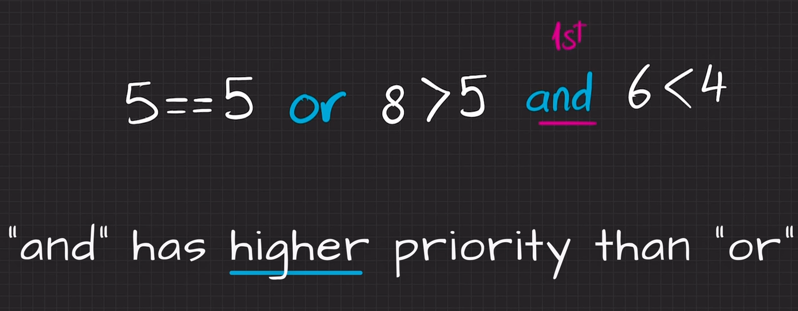

## **57)** (Membership Operators)

### **in**

>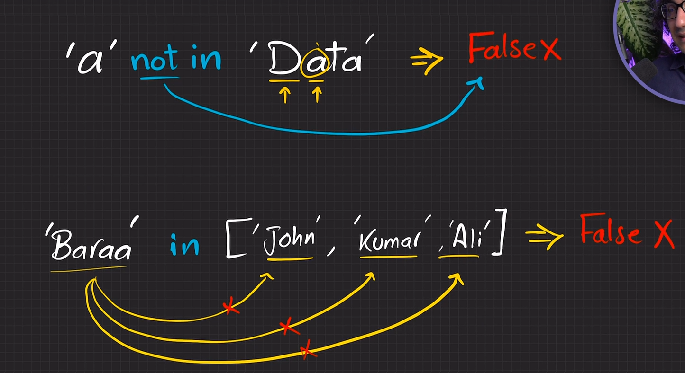

## **58)** (Identify Operators)

### **is**
>i kqyr id a i kan njejt
>
>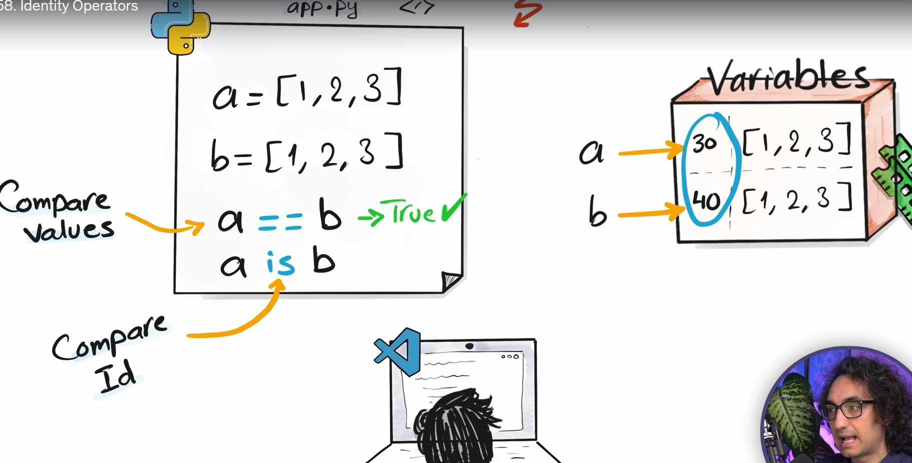
>
>nese skena objekte konplekse i bon ni id qe mos me zan ven
>
>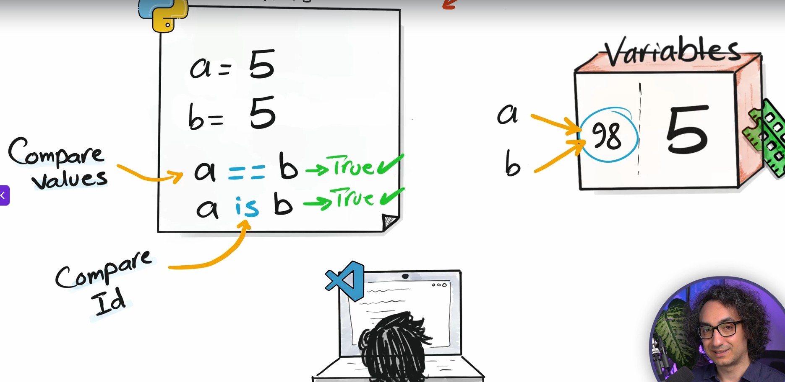
>
>qysh nuk kijon new id
>
>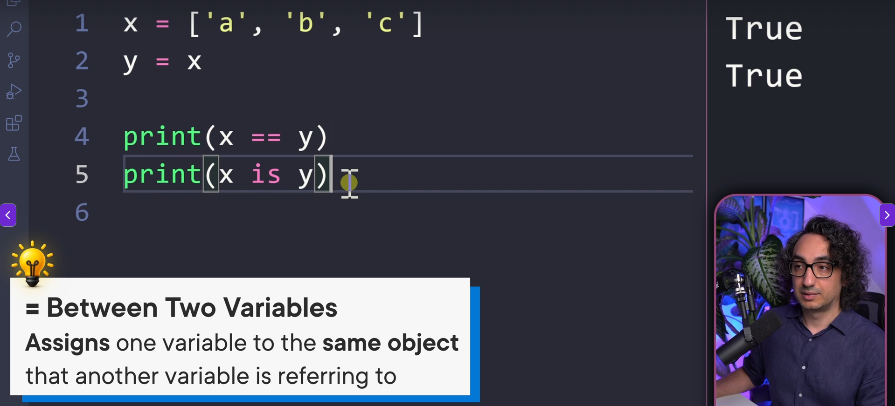
>
>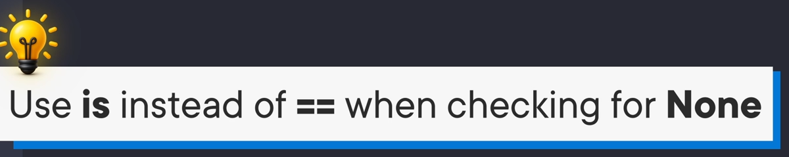
