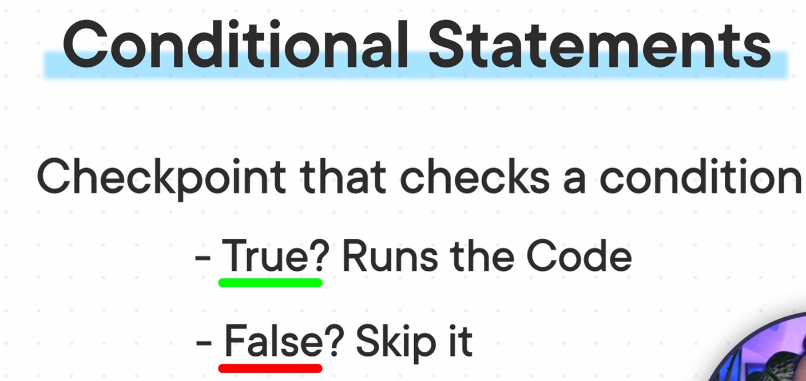
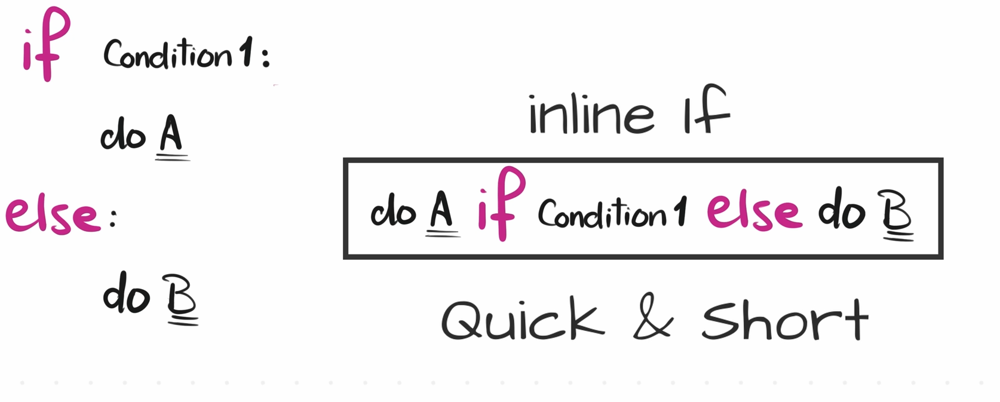
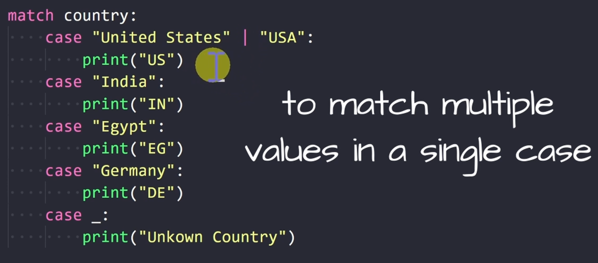
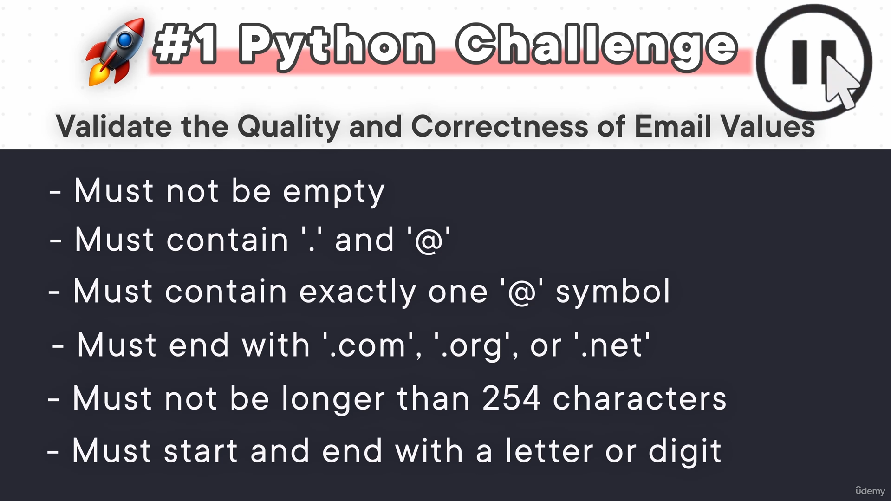

# Sectoin 7

## **62)**
>

## **63)**

## **if**
>if njehet qka ka n tab pra si ka {}
>
>preferohet mi bo 4 tab size
>
>CTRL + SHIFT + P
>
>Preferences: Open User Settings (JSON)
>```
>    "[python]":{
>        "editor.tabSize": 4,
>        "editor.insertSpaces": true
>    }
>```

## **64)**

## **else**
>nese su plotsu asni kusht
>
>duhet me bo else:

## **65)**

## **elif**
>osht optional
>
>duhet me bo elif:
>
>osht si else if

## **69)**

## **inline if**
>vetem nese o logjika o very simple
>
>elif sbon
>
>qysh doket:
>
>"A" if score >= 90 else "B" if score >80 else "F"
>
>

## **70)**

## **match case**
>
>nese o case _: i bjen qe others
>

## **72)**

## **Challange**
>
>
>
> ```python
> email = "baraa@gmail.com"
> valid = True
> 
> # Clean the String
> email = email.strip()
> 
> # Email must not be empty
> if email == "":
>     print("Email cannot be empty.")
>     valid = False
> 
> # Email must contain a '.' and '@'
> if not('.' in email and '@' in email):
>     print("Email must contain . and @")
>     valid = False
> 
> # Email must contain exactly one '@' symbol
> if email.count('@') != 1:
>     print("Email must contain exactly one @.")
>     valid = False
> 
> # Email must end with '.com', '.org', or '.net'
> if not email.endswith(('.com', '.org', '.net')):
>     print("Email must end with .com, .org, or .net")
>     valid = False
> 
> # Email must not be longer than 254 characters
> if len(email) > 254:
>     print("Email must not be longer than 254 characters")
>     valid = False
> 
> # Email must start and end with a letter or digit
> if not(email[0].isalnum() and email[-1].isalnum()):
>     print("Email must start and end with a letter or digit")
>     valid = False
> 
> if valid:
>     print("Email is valid.")
> ```
