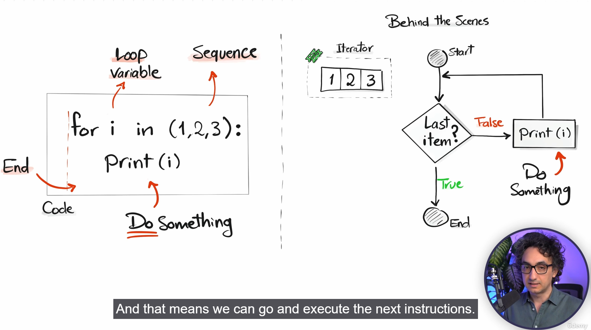
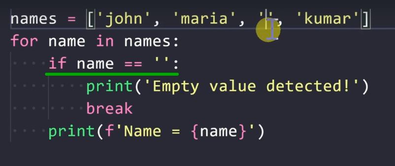
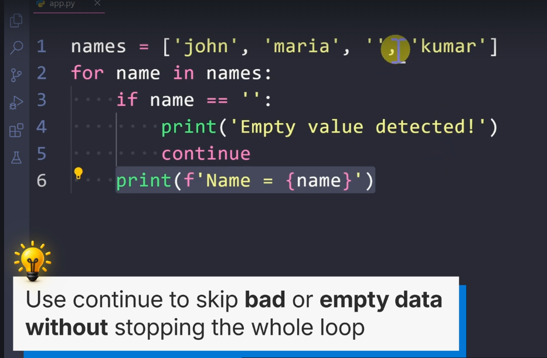
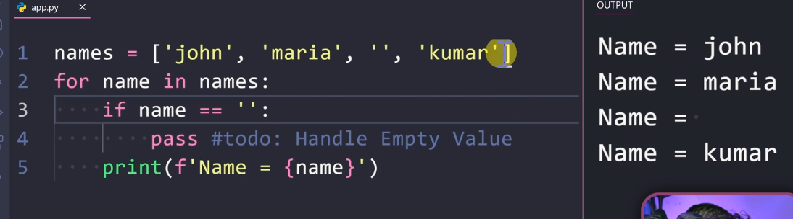
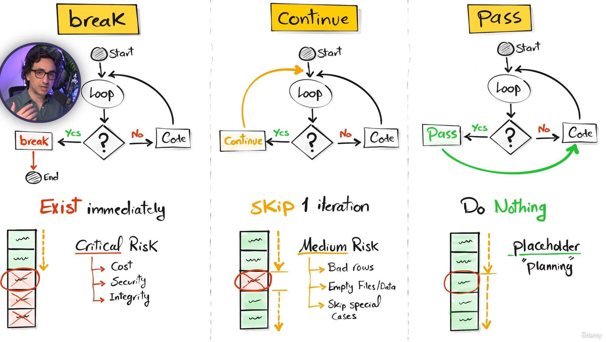
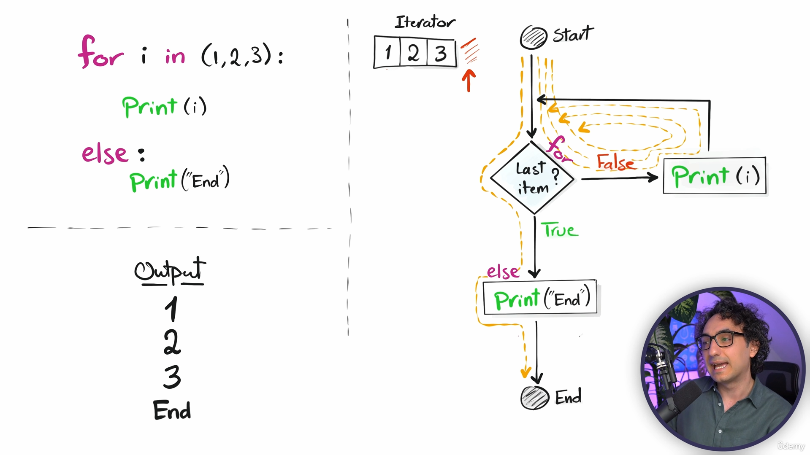
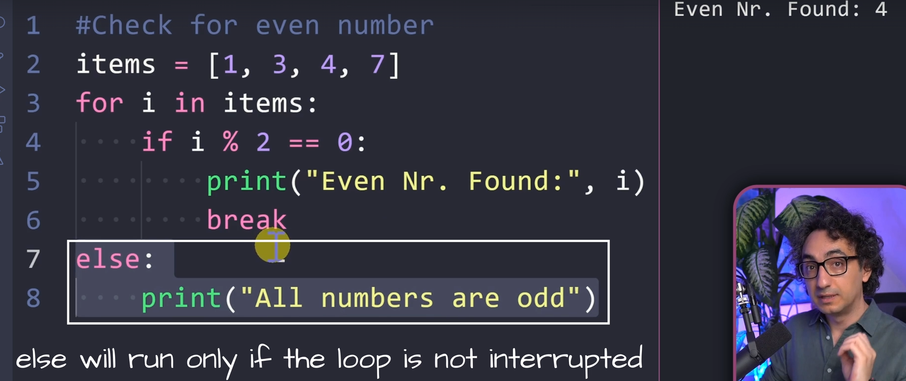
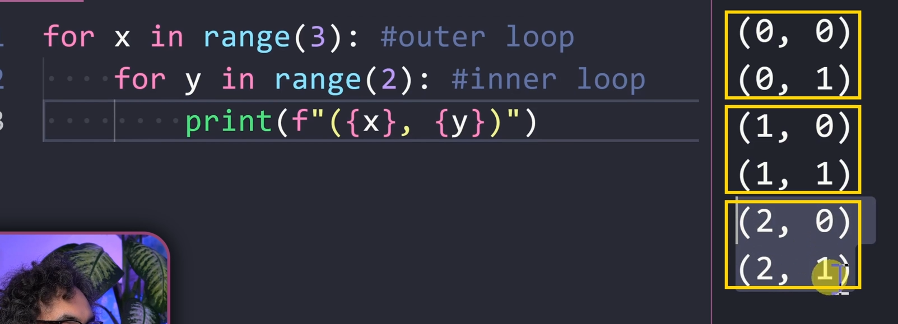

# Section 8

## **76)** (For Loops)

### **for i in (1,2,3):**
>

## **77)** (For Loops in Sequence)
>mujna me perdor psh [1,2,3,"hi"]
>
>ose ["Python"]

### **range(stop)**
>for i in range(5):
>
>outout prej 0 dej 4

### **range(start,stop)**
>for i in range(1,5):
>
>outout prej 1 dej 4
>
>by default o 0

### **range(start,stop,step)**
>for i in range(0,10,2):
>
>outout 0,2,4,6,8
>
>pra qdo 2

## **80)** (Break)
>e nal kodin
>
>

## **81)** (Continue)
>e bon skip at step
>
>

## **82)** (Pass)
>e bon pass i step dmth per me ndreq ma von
>
>

## **84)** (Break vs Continue vs Pass)
>

## **85)** (For else)
>n else e print masi ta kryn loop
>
>

## **86)** (For else Break)
>nese ka break edhe qaj kusht plotsohet , else nuk bohet kurr
>
>

## **88)** (Nested Loop)
>

## **89)** (Nested Loop Use Case)
