# Section 10

## **97)** (Data Structures)
>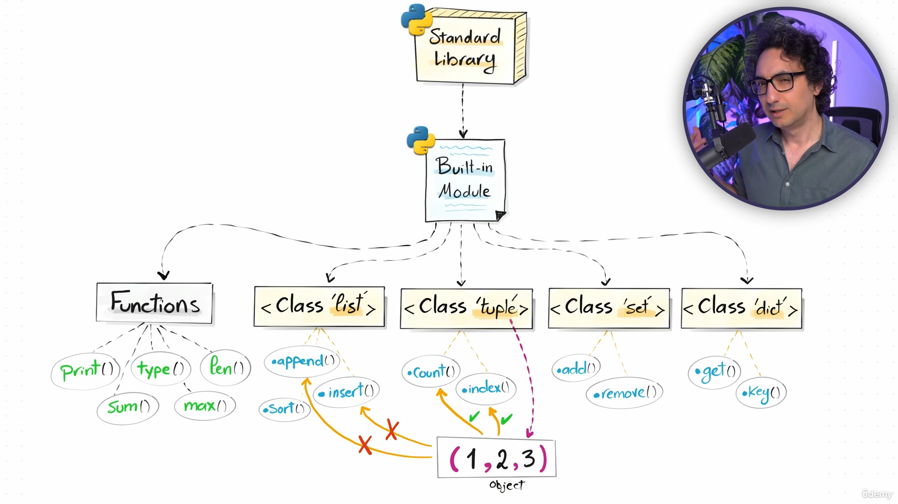

### **Function vss methods**
>funksionet nuk i manipuloj t dhanat veq i bojn return ni vler prej tyne
>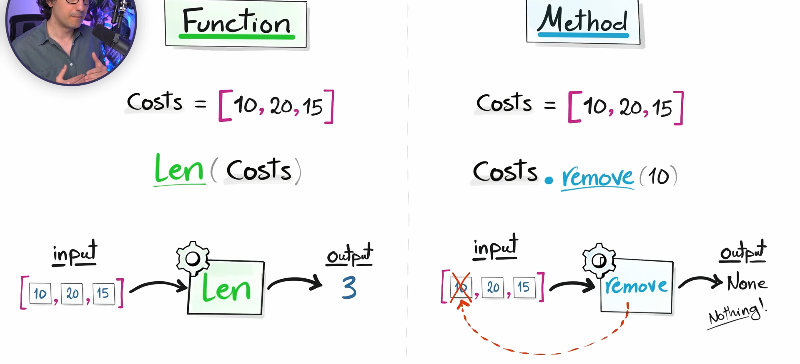

## **99)** (List Methods)
>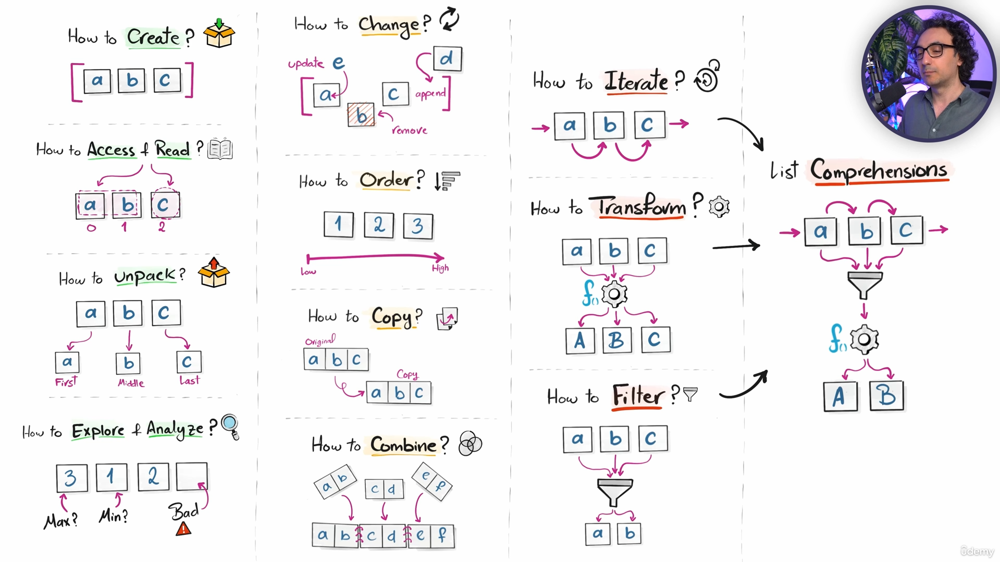

## **100)** (Creating Lists)
>empty = []
>
>mujna me bo mix n list psht:
>
>mixedlist = ["a",1,True,None]

### **list()**
>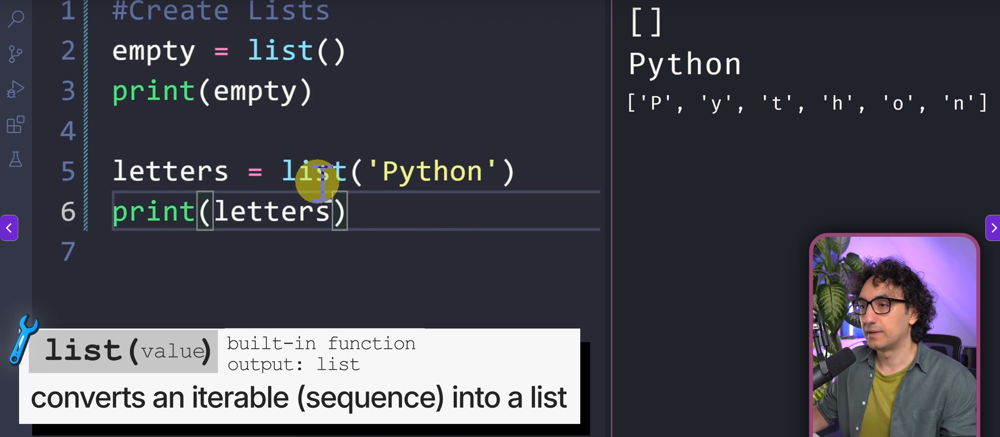
>
>per numra psh:
>
>list(range(5))

## **101)** (Nested Lists)
>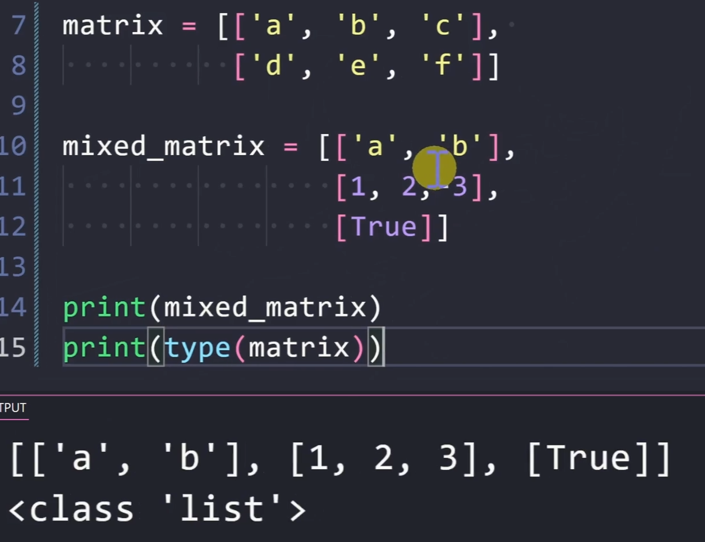

## **102)** (Indexing)
>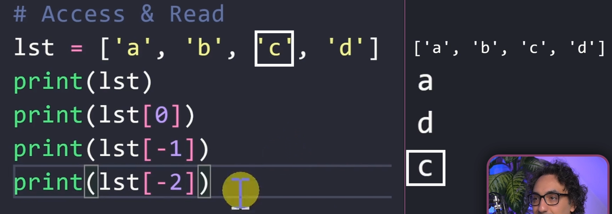

### **Nested Lists**
>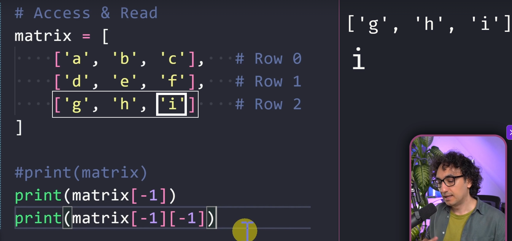

## **103)** (Slicing)
>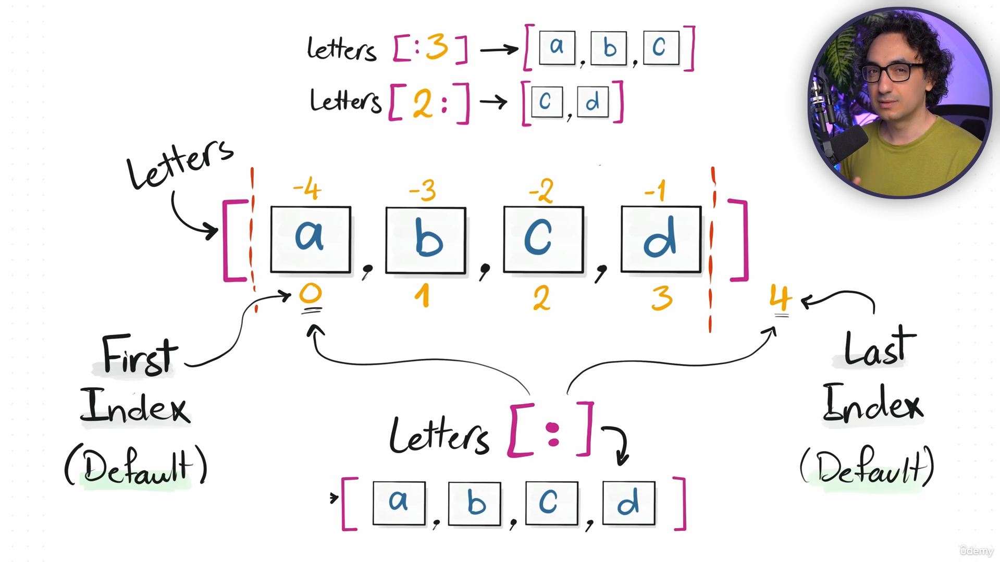

## **104)** (List Unpacking)
>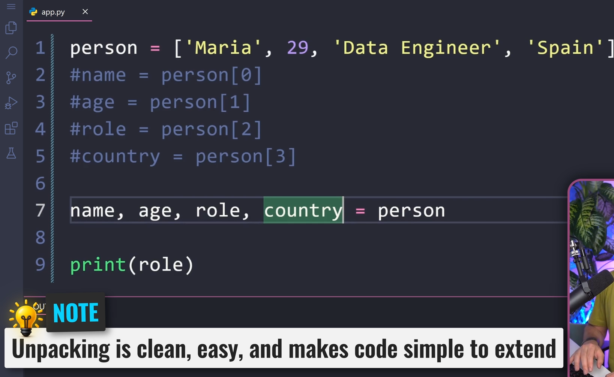

## **105)** (Unpacking Asterisk)
>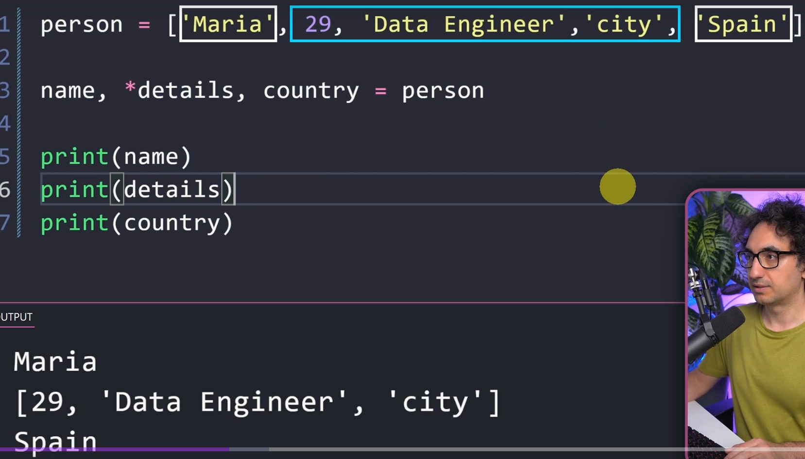
>
>veq ni * osht allowed me use te unpacing asterisk
>
>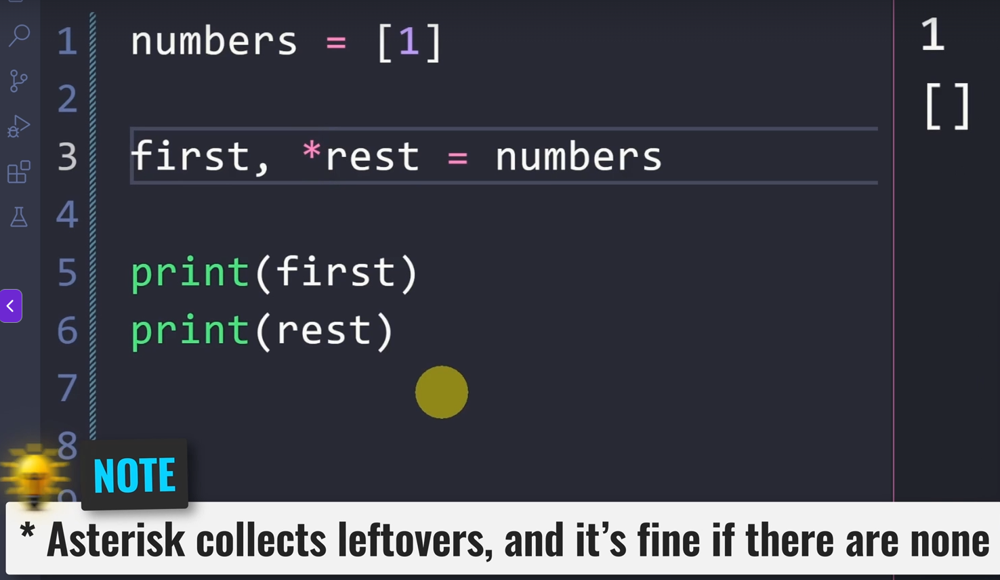
>
>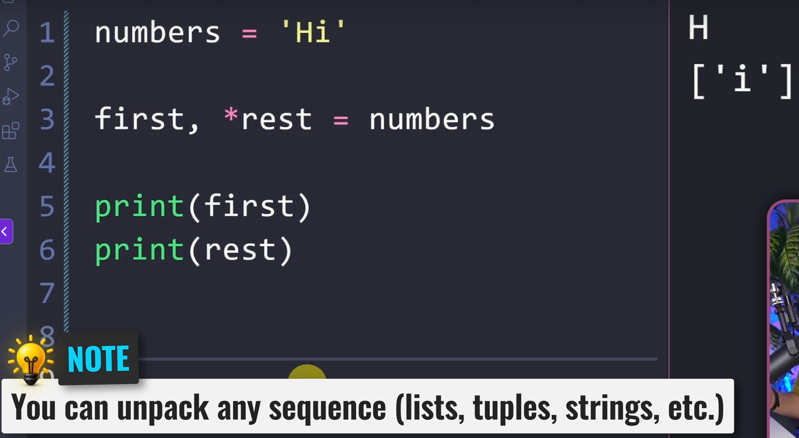

## **106)** (Unpacking Underscore)
>undescore (_) to skip
>
>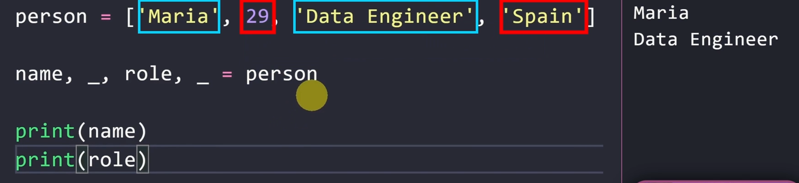
>
>can use *_

## **107)** (Analysing Lists)
>
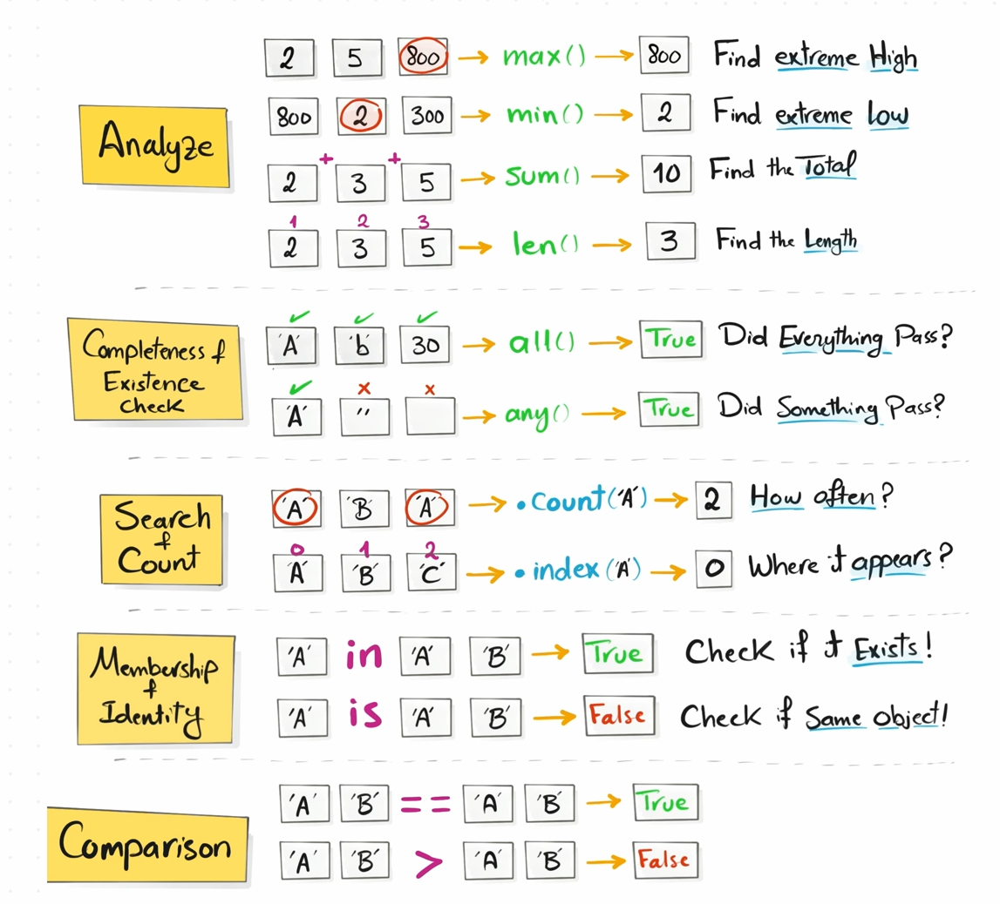

## **108)** (all() and any())
>
>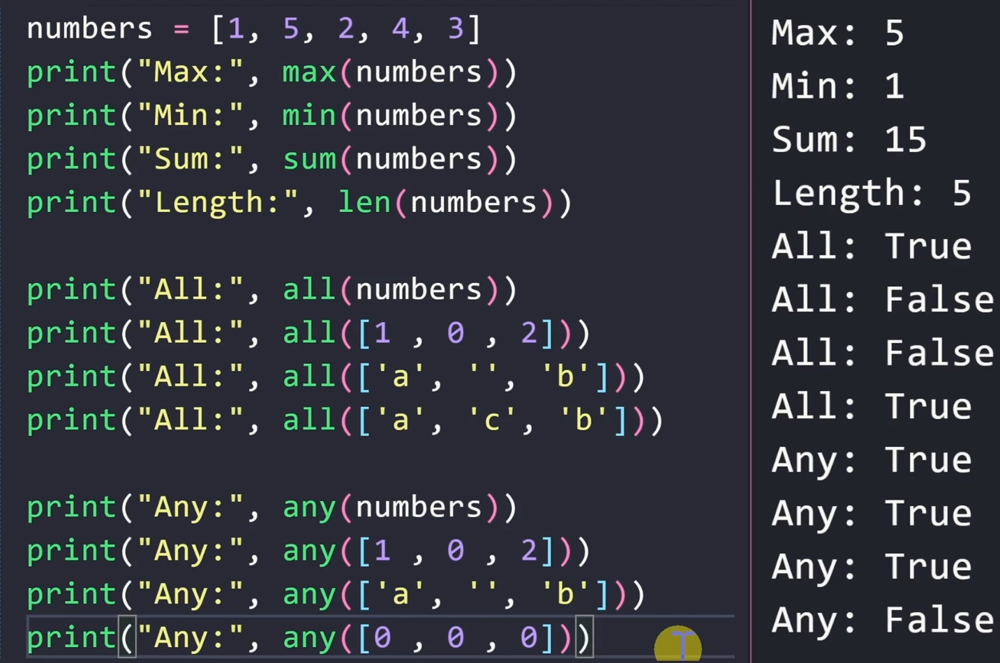

## **109)** (count() and index())
>numbers = [1,2,3,4,5]
>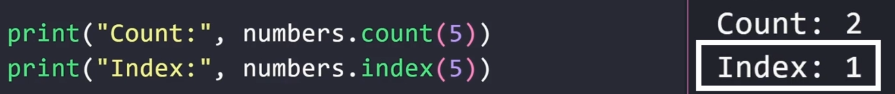

## **110)** (in and is)
>is e kqyr memory adress , pra list1 nuk o is me list2 edhe pse i kan kejt njejt
>
>in psh 9 in list1

## **111)** (adding items)

### **append()**
>e shton n fund listes
>
>letters.append('c')

### **insert()**
>e shton n pozit specifike t listes, pra per pozit 3
>
>letters.insert(2,'c')
>
>edhe per lista 2 :
>
>letters[1].insert(2,'c')

## **112)** (removing items)

### **clear()**
>i bone remove kejt mrena liste

### **remove()**
>e bon remove by value
>
>pra nese jan dy "a" ne list , veq "a" te par e bon remove

### **pop()**
>e bon remove by specific position

## **113)** (updating items)

### **letters[0] = "C"**
>qeshtu e bojna override
>
>nese e bojna letters = "C", e kthen kejt listen n string edhe outputi o veq C

## **114)** (Sorting list)

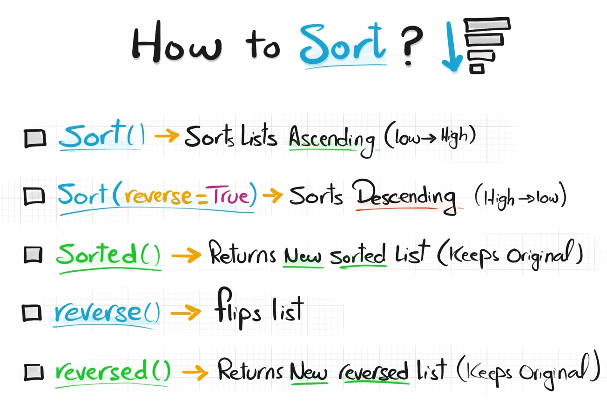

### **sort()**
>i bon sort prej mas poshti te mas nalti

### **sort(reverse= true)**
>i bon sort prej mas nalti te mas poshti

### **te listat qe kan list**
>i bon sort pozitat e para
>
>nese poz e para jan njejta i mer dytat

### **newList = sorted(list)**
>e bon listen prej lowest to highest tu kriju njo t re
>
>pa ndru origjinalin

### **newList = sorted(list, reverse = true)**
>e bon listen prej highestto lowest tu kriju njo t re
>
>pa ndru origjinalin

## **115)** (Reversig List)

### **reverse()**
>e rrutollon listen

### **newList = reversed(list)**
>e rrutollon listen
>
>pa ndrru origjinalin
>
>type: iterator
>
>per me bo list list(reversed(list))

