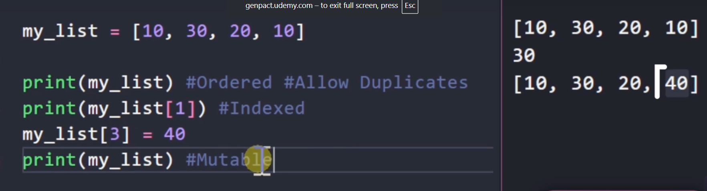
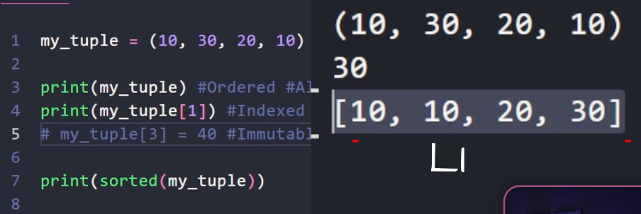
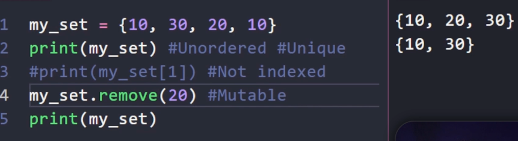

# Section 12

## **130)** (Lists)
>

## **131)** (Tubles)
>smun me i change veq me i read
>
>nese jena tu i stored , so mo list
>
>

## **132**(Sets)
>veq mujna me i change, jo mi ndrru
>
>

## **133**(Sets Methods)

### **.add()**
>e bon add ni value
>
>perdore veq nese o e re

### **.update([1,1,"HI"])**
> i shton n set e bon update, n qet rast shtohen 1,2,"H","I"

### **sets |={1,2}**
>shortcut for update

### **a.remove(1)**
>nese soth ne set shfaq error

### **a.discard(1)**
>e njejt si remove veq nese so n set sbon error

## **134** (Sets Math Operator)

### **a.union(b)**
>i mer setet edhe i bon 1
>
>nese ka duplicate, veq 1 e merr
**a | b**
>shortcut per union()

### **a.intersection(b)**
>i mer perbashkat e seteve
**a & b**
>shortcut per intersection()

### **a.diference(b)**
>i mer veq qa i ka diferent a e si ka seti b
**a - b**
>shortcut per diference()
