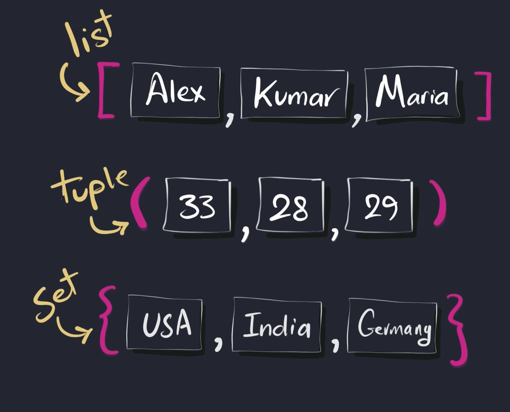
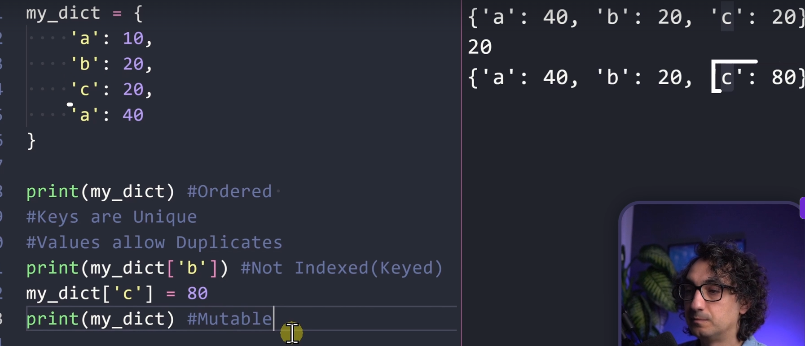
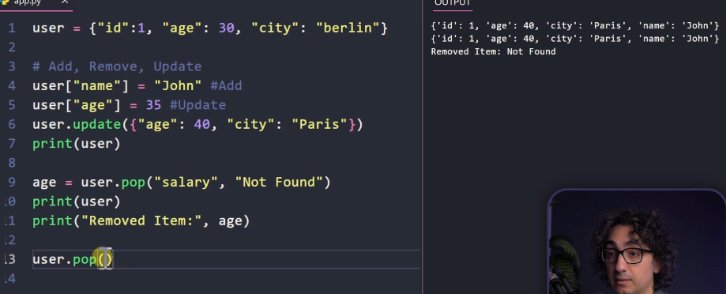
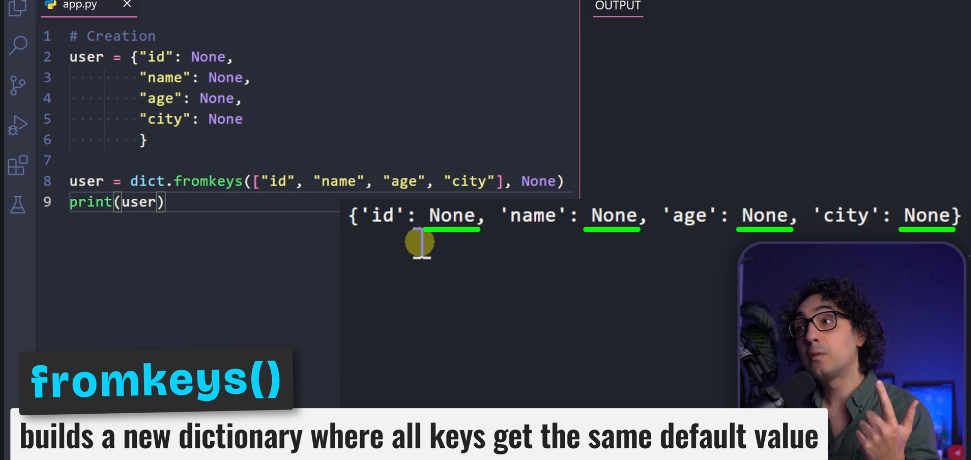
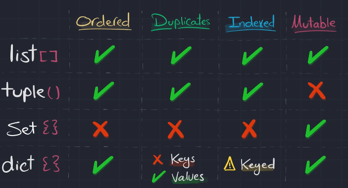

# Section 12

>

## **130)** (Lists)
>

## **131)** (Tubles)
>smun me i change veq me i read
>
>nese jena tu i stored , so mo list
>
>

## **132**(Sets)
>veq mujna me i change, jo mi ndrru
>
>

## **133**(Sets Methods)

### **.add()**
>e bon add ni value
>
>perdore veq nese o e re

### **.update([1,1,"HI"])**
> i shton n set e bon update, n qet rast shtohen 1,2,"H","I"

### **sets |={1,2}**
>shortcut for update

### **a.remove(1)**
>nese soth ne set shfaq error

### **a.discard(1)**
>e njejt si remove veq nese so n set sbon error

## **134** (Sets Math Operator)

### **a.union(b)**
>i mer setet edhe i bon 1
>
>nese ka duplicate, veq 1 e merr

**a | b**
>shortcut per union()

### **a.intersection(b)**
>i mer perbashkat e seteve

**a & b**
>shortcut per intersection()

### **a.difference(b)**
>i mer veq qa i ka diferent a e si ka seti b

**a - b**
>shortcut per difference()

### **a.symmetric_difference(b)**
>i mer veq qa i ka diferent dy setet
>
>dmth veq perbashtat si shfaq

## **135)** (Sets Relationships)

### **aissubset(b)**
>kthen true/false a jan kejt elementet e setit 1 n 2

### **a.issuperset(b)**
>e kqyr setin 1 edhe pse ka mashum elemente a i ka seti 2

### **a.isdisjoint(b)**
>kur nuk jon tu over lap bon return true, dmth kur skan sen tnjejt, perndryshe false

## **136)** (Dictionaries)
>

## **137)** (Dictionaries Methods)

### **dir.get("name")**
>e kthen name nese ska e return None
>
>tash nese o none e dojna me na kthy "ska sen"
>
>dir.get("name","ska sen")

### **"name" is user**
>true/false

### **dir.keys()**
>kthen kejt key

### **dir.values()**
>kthen kejt values

### **dir.items()**
>kthen kejt key edhe values

### **add, remove, update**
>

### **fromkeys()**
>

## **140)** (Data Structures Review)
>
