# Secion 14

## **141)** (Functions Types)
>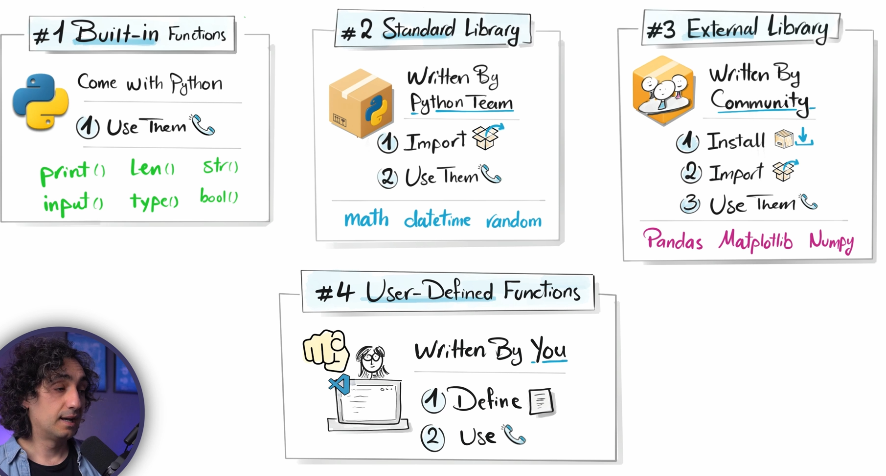

### **GOLDEN RULE**
>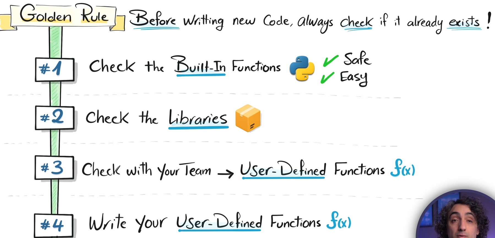

## **146)** (Parameters, Arguments)
>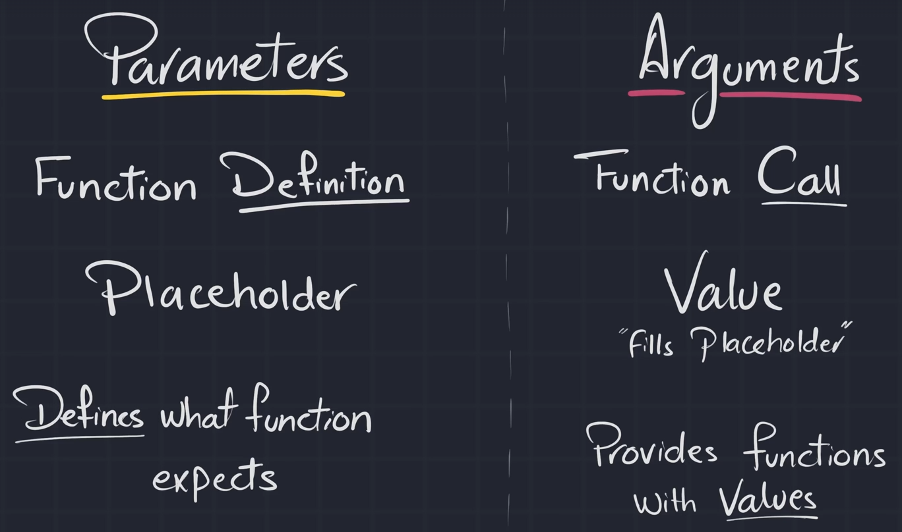

## **146)** (Variable Scope)
>variablen lokale mujna me use veq n funksion
>
>smujna me thirr prej jasht

## **150)** (Keywords Arg)
>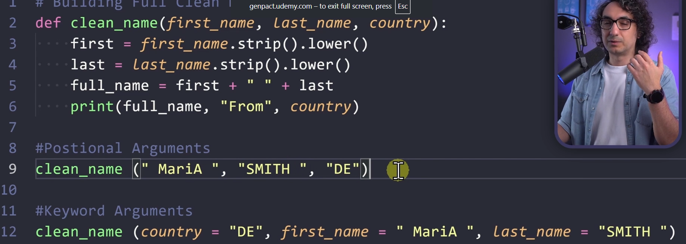
>
>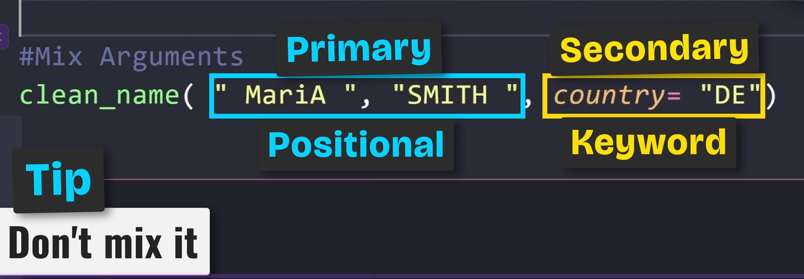

## **150)** (*arg)
>bon per same value
>
>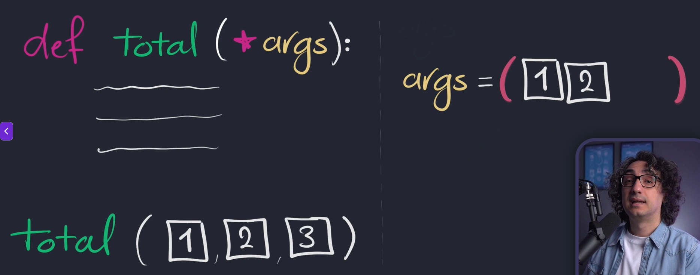

## **151)** (**arg)
>bon per different value
>
>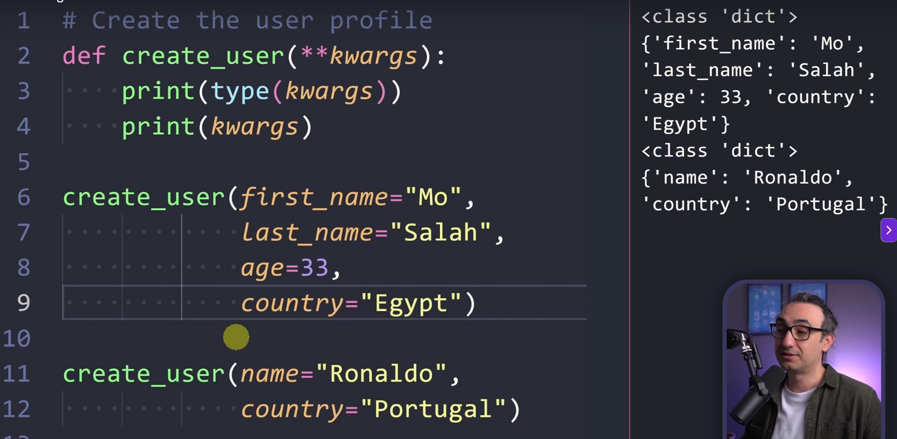
>
>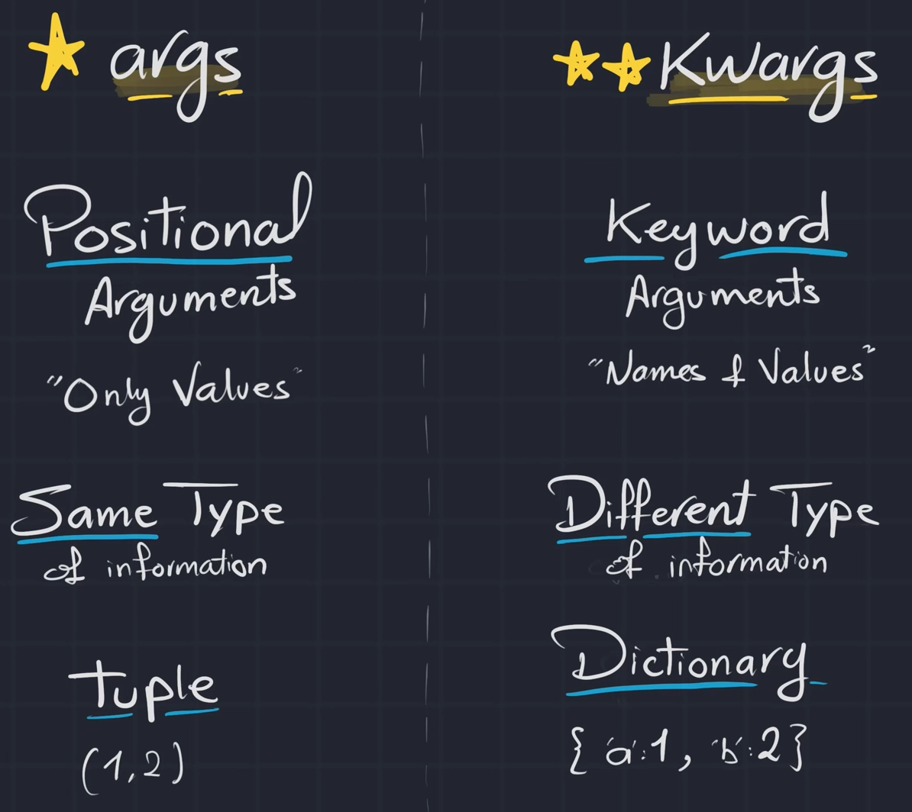

## **155)** (return)
>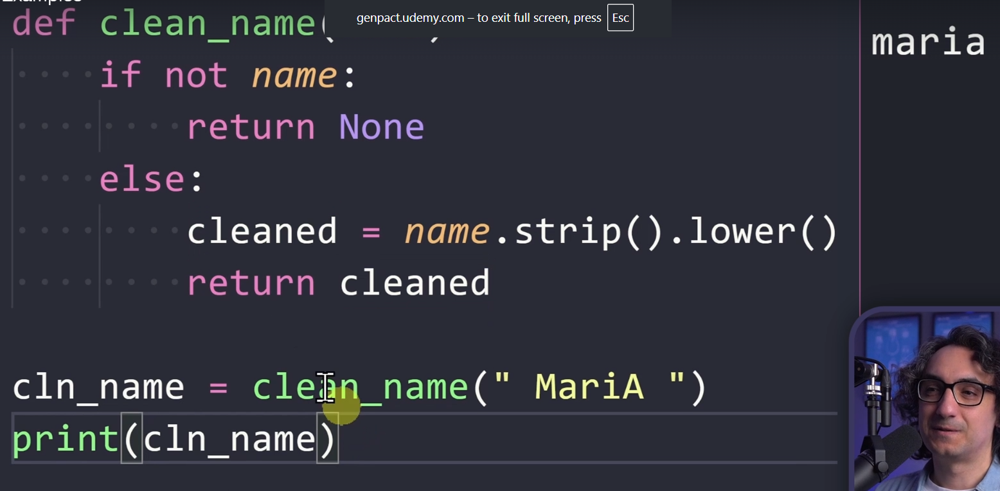

## **157)** (Action Functions)
>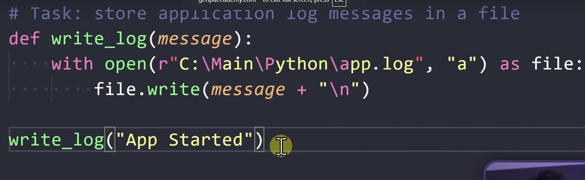

## **158)** (Transformation Functions)
>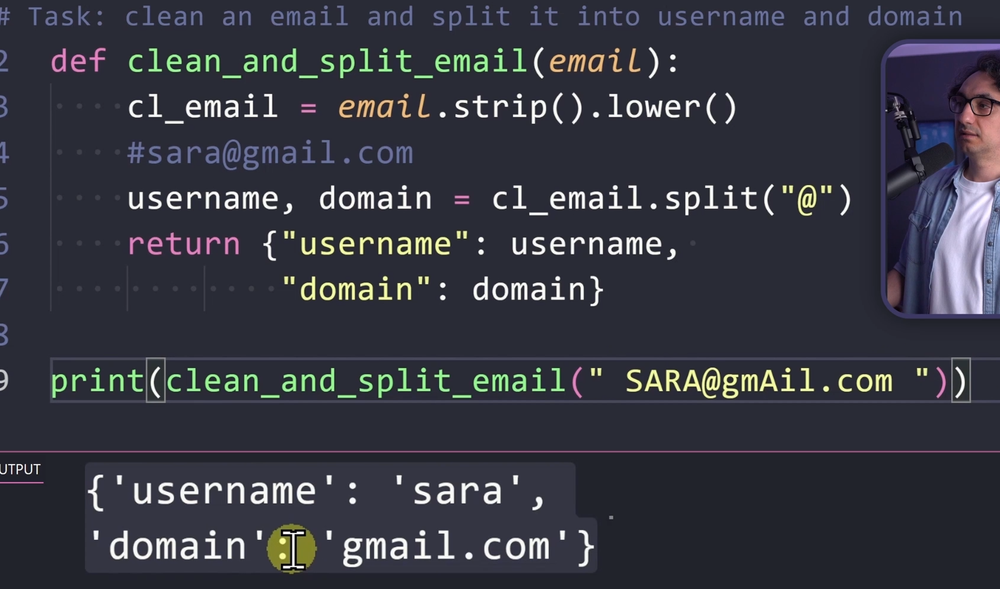

## **159)** (Validation Functions)
>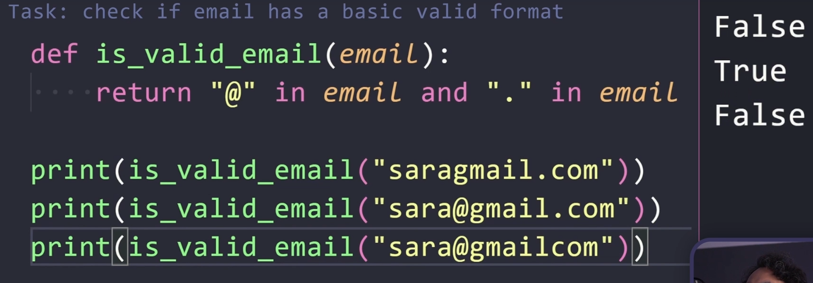

## **159)** (Orchestrator Functions)
>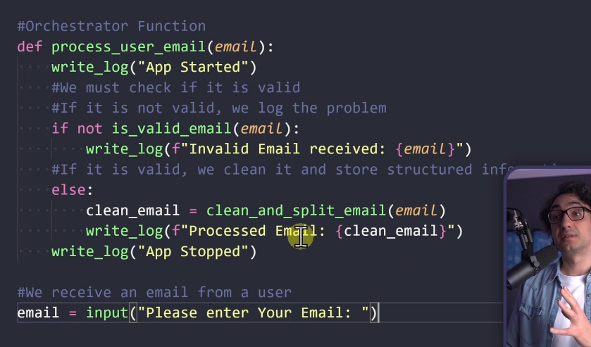

## **159)** (Functions Types Review)
>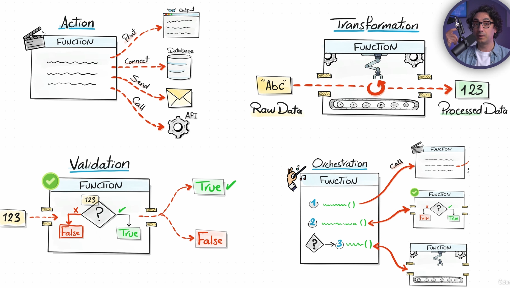
